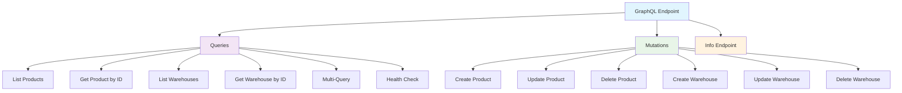
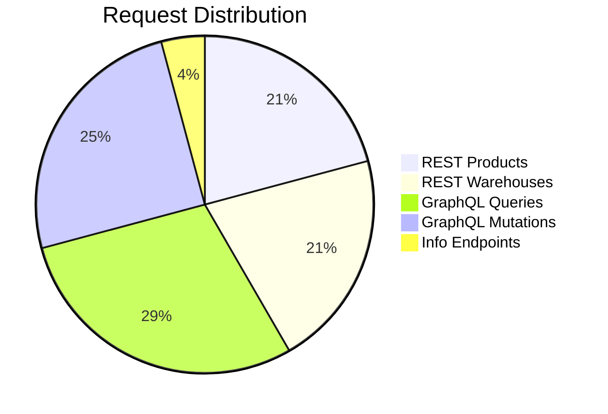
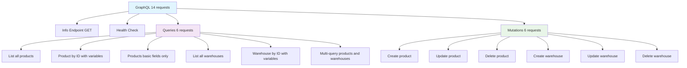
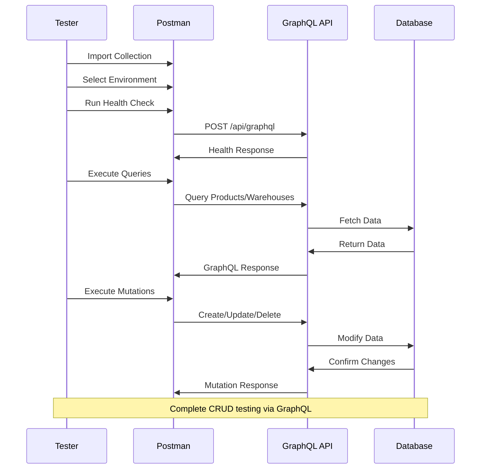

<link rel="stylesheet" href="https://diegobarrosa.github.io/diegobarrosaraya-assets/shared-theme.css">
<link rel="stylesheet" href="https://diegobarrosa.github.io/diegobarrosaraya-assets/shared-footer.css">
<script src="https://diegobarrosa.github.io/diegobarrosaraya-assets/shared-theme.js"></script>

# GraphQL Testing Guide

The Postman collection includes comprehensive GraphQL testing with 14 requests covering all available operations.

## GraphQL Endpoint Overview



## Available GraphQL Endpoints

### Queries (Read Operations)
1. **Health Check** - Verify GraphQL API status
2. **List products (complete fields)** - Including timestamps
3. **Product by ID with variables** - Uses `{{producto_id}}`
4. **Products (basic fields)** - Only id, name, price
5. **List warehouses (complete fields)** - Including timestamps
6. **Warehouse by ID with variables** - Uses `{{bodega_id}}`
7. **Multi-query** - Products and warehouses in single request

### Mutations (Write Operations)
8. **Create product** - Mutation with complete input
9. **Update product** - Mutation with ProductoUpdateInput
10. **Delete product** - Mutation with ID
11. **Create warehouse** - Mutation with complete input
12. **Update warehouse** - Mutation with BodegaUpdateInput
13. **Delete warehouse** - Mutation with ID
14. **Info endpoint** - GET request for endpoint information

## Collection Summary



| Category | Requests | Description |
|----------|----------|-------------|
| **Products** | 5 | Complete REST CRUD |
| **Warehouses** | 5 | Complete REST CRUD |
| **GraphQL Queries** | 7 | Read operations |
| **GraphQL Mutations** | 6 | Write operations |
| **GraphQL Info** | 1 | Endpoint information |
| **TOTAL** | **24** | **Complete coverage** |

## Usage Examples

### Health Check
```bash
curl -u user:myStrongPassword123 -X POST http://localhost:8080/api/graphql \
  -H "Content-Type: application/json" \
  -d '{"query":"{ health }","variables":{}}'
```

**Response:**
```json
{
  "data": {
    "health": "GraphQL API funcionando correctamente"
  }
}
```

### List Products
```bash
curl -u user:myStrongPassword123 -X POST http://localhost:8080/api/graphql \
  -H "Content-Type: application/json" \
  -d '{"query":"{ productos { id nombre precio cantidad } }"}'
```

**Response:**
```json
{
  "data": {
    "productos": [
      {
        "id": "2",
        "nombre": "Frijoles",
        "precio": 30.0,
        "cantidad": 200
      }
    ]
  }
}
```

### Multi-Query
```bash
curl -u user:myStrongPassword123 -X POST http://localhost:8080/api/graphql \
  -H "Content-Type: application/json" \
  -d '{"query":"{ productos { id nombre precio } bodegas { id nombre ubicacion } }"}'
```

**Response:**
```json
{
  "data": {
    "productos": [...],
    "bodegas": [...]
  }
}
```

## Complete GraphQL Schema

### Types

```graphql
type Producto {
    id: ID!
    nombre: String!
    descripcion: String
    precio: Float!
    cantidad: Int!
    fechaCreacion: DateTime
    fechaActualizacion: DateTime
}

type Bodega {
    id: ID!
    nombre: String!
    ubicacion: String!
    capacidad: Int!
    fechaCreacion: DateTime
    fechaActualizacion: DateTime
}
```

### Available Queries

```graphql
type Query {
    # Products
    productos: [Producto!]!
    producto(id: ID!): Producto
    
    # Warehouses
    bodegas: [Bodega!]!
    bodega(id: ID!): Bodega
    
    # Health check
    health: String!
}
```

### Available Mutations

```graphql
type Mutation {
    # Products
    crearProducto(input: ProductoInput!): ProductoResponse!
    actualizarProducto(input: ProductoUpdateInput!): ProductoResponse!
    eliminarProducto(id: ID!): DeleteResponse!
    
    # Warehouses
    crearBodega(input: BodegaInput!): BodegaResponse!
    actualizarBodega(input: BodegaUpdateInput!): BodegaResponse!
    eliminarBodega(id: ID!): DeleteResponse!
}
```

## Use Cases Coverage

### Read Operations (Queries)
- Get all resources
- Get resource by ID
- Specific field selection
- Multiple simultaneous queries
- API health verification

### Write Operations (Mutations)
- Create resources (products and warehouses)
- Partial resource updates
- Delete resources
- Structured responses with success/error

### Advanced Features
- Typed variables (`$id: ID!`)
- Operation names for debugging
- Complex inputs (ProductoInput, BodegaInput)
- Union-type responses (success + data + error)

## Variables in Postman

GraphQL requests use Postman variables:

```json
{
  "query": "query GetProducto($id: ID!) { 
    producto(id: $id) { 
      id nombre precio cantidad 
    } 
  }",
  "variables": {
    "id": "{{producto_id}}"
  }
}
```

**Benefit:** Change `{{producto_id}}` in environment and it updates in all requests.

## Collection Structure



## Collection Features

### Complete Coverage
- All queries from GraphQL schema
- All available mutations
- Health check included

### Parameterized Variables
- Uses `{{producto_id}}` and `{{bodega_id}}` from environment
- Easy ID changes without editing queries

### Realistic Examples
- Complete sample data
- Descriptive names
- Inline comments where needed

### Clear Organization
- Separation between Queries and Mutations
- Descriptive request names
- Logical grouping

## Automated Testing

### Running Complete GraphQL Folder
1. In Postman, right-click "GraphQL"
2. Select "Run folder"
3. Select all 14 requests
4. Click "Run GraphQL"

### Suggested Test Scripts

Add to the "Tests" tab of each request:

```javascript
// Verify successful response
pm.test("Status code is 200", () => {
    pm.response.to.have.status(200);
});

// Verify data exists
pm.test("Response has data", () => {
    const jsonData = pm.response.json();
    pm.expect(jsonData.data).to.exist;
});

// For mutations: verify success
pm.test("Mutation was successful", () => {
    const jsonData = pm.response.json();
    if (jsonData.data) {
        const mutation = Object.values(jsonData.data)[0];
        pm.expect(mutation.success).to.be.true;
    }
});
```

## Testing Workflow



## Development Resources

### GraphQL Documentation
- [GraphQL Official Docs](https://graphql.org/)
- [GraphQL Best Practices](https://graphql.org/learn/best-practices/)

### Project Implementation
- **Schema**: `agranelos-functions-crud-create/src/main/resources/schema.graphqls`
- **Implementation**: `agranelos-functions-crud-create/src/main/java/com/agranelos/inventario/graphql/`

## Next Steps

### Immediate Actions
1. Import updated collection in Postman
2. Test each request for familiarity
3. Execute complete folder for regression testing
4. Add automated tests using examples above
5. Document project-specific use cases

### Future Extensions
- Add GraphQL subscriptions (if implemented)
- Add fragments for reusability
- Create collections for different user roles
- Integrate with Newman for CI/CD

## Troubleshooting

### Common Issues

**GraphQL endpoint not responding:**
- Verify Azure Functions are running
- Check network connectivity
- Validate authentication credentials

**Variables not working:**
- Ensure environment is selected in Postman
- Verify variable names match (`{{producto_id}}`, `{{bodega_id}}`)
- Check variable values are set in environment

**Mutation failures:**
- Validate input data format
- Check required fields in schema
- Verify database connectivity

### Debugging

```bash
# Test GraphQL endpoint directly
curl -u user:password http://localhost:8080/api/graphql \
  -H "Content-Type: application/json" \
  -d '{"query":"{ health }"}'

# Check Postman variables
# In Postman: Environment quick look (eye icon)

# Validate schema
# Access GraphQL playground at /graphql endpoint
```

---

**Total GraphQL Endpoints:** 14 (7 queries + 6 mutations + 1 info)  
**Documentation Version:** 2.0.0  
**Last Updated:** October 12, 2025