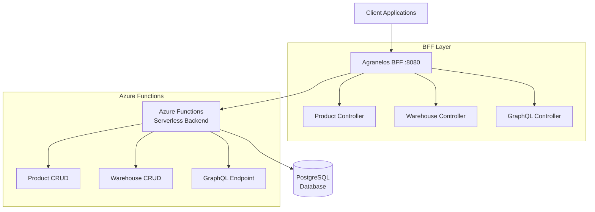

<link rel="stylesheet" href="https://diegobarrosa.github.io/diegobarrosaraya-assets/shared-theme.css">
<link rel="stylesheet" href="https://diegobarrosa.github.io/diegobarrosaraya-assets/shared-footer.css">

# Agranelos BFF Documentation

This documentation covers the Backend For Frontend (BFF) service for the Agranelos inventory management system.

## API Documentation

- [Endpoints Mapping](api/endpoints-mapping) - Complete mapping of Azure Functions to BFF endpoints
- [Warehouse Management](api/warehouse-management) - Enhanced warehouse deletion with product handling
- [Examples and Usage](api/examples) - Practical examples and usage patterns

## Development

- [Setup and Configuration](development/setup) - Local development setup and configuration
- [Docker Deployment](development/docker) - Container-based deployment guide
- [Implementation Details](development/implementation) - Technical implementation details

## Testing

- [Postman Environments](testing/postman-environments) - Multi-environment testing configuration
- [GraphQL Testing Guide](api/graphql-testing) - Complete GraphQL testing documentation
- [Container Testing Results](development/container-testing) - Podman/Docker testing validation
- [Testing Workflows](testing/workflows) - Complete testing workflows and examples

## Architecture

## Key Features

- **Dual API Support**: Both REST and GraphQL endpoints
- **Enhanced Warehouse Management**: Intelligent product handling during warehouse deletion
- **Comprehensive Validation**: Automatic validation with detailed error responses
- **Docker Ready**: Complete containerization support
- **Extensive Testing**: Full Postman collection with workflow examples

## Quick Start

1. **Prerequisites**: Java 17+, Maven 3.6+, Docker/Podman
2. **Configuration**: Set `AZURE_FUNCTIONS_BASE_URL` environment variable
3. **Run**: `mvn spring-boot:run` or use Docker compose
4. **Test**: Import Postman collection and execute test workflows

For detailed setup instructions, see the [Setup Guide](development/setup).