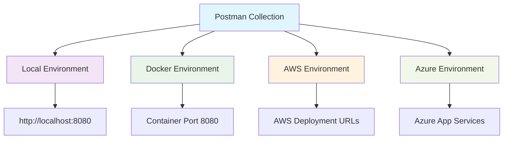
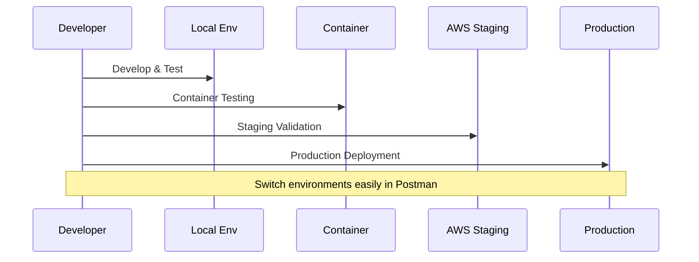

<link rel="stylesheet" href="https://diegobarrosa.github.io/diegobarrosaraya-assets/shared-theme.css">
<link rel="stylesheet" href="https://diegobarrosa.github.io/diegobarrosaraya-assets/shared-footer.css">
<script src="https://diegobarrosa.github.io/diegobarrosaraya-assets/shared-theme.js"></script>

# Testing Environments Configuration

The Agranelos BFF Postman collection now includes comprehensive support for multiple environments, enabling seamless switching between local development, containerized testing, and cloud deployments.

## Environment Overview



## Collection Status

### Current Implementation
The collection includes:
- All 16 endpoints implemented (5 Products + 5 Warehouses + 6 GraphQL)
- HTTP Basic Authentication configured
- Parameterized variables (`base_url`, `producto_id`, `bodega_id`)
- Sample data for each endpoint

### Environment Support
Four environment files available:
1. **Local** - `http://localhost:8080` (local development)
2. **Docker/Podman** - `http://localhost:8080` (containerized)
3. **AWS** - Configurable for AWS deployment
4. **Azure** - Configurable for Azure deployment

## File Structure

```
postman/
├── README.md                        # Usage guide
├── Local.postman_environment.json   # Local environment
├── Docker.postman_environment.json  # Container environment
├── AWS.postman_environment.json     # AWS environment
└── Azure.postman_environment.json   # Azure environment
```

Main collection:
- `Agranelos-BFF.postman_collection.json` (root directory)

## Setup Instructions

### Import Collection and Environments

1. Open Postman
2. Click "Import"
3. Select `Agranelos-BFF.postman_collection.json`
4. Import all files from `postman/` directory
5. Click "Import"

### Select Environment

Use the dropdown in the top-right corner of Postman:

**Local Development (Spring Boot):**
- Select: **Local Environment**
- Automatic URL: `http://localhost:8080`

**Container Testing (Docker/Podman):**
- Select: **Docker/Podman Environment**
- Automatic URL: `http://localhost:8080`

**AWS Deployment:**
- Select: **AWS Environment**
- Edit `base_url` with your domain

**Azure Deployment:**
- Select: **Azure Environment**
- Edit `base_url` with your App Service URL

## Cloud Configuration

### AWS Environment Setup

1. Click the environment icon (eye symbol)
2. Click **Edit** on "AWS Environment"
3. Update `base_url`:

```json
// Load Balancer
"base_url": "https://api.agranelos.com"

// API Gateway + Lambda
"base_url": "https://abc123.execute-api.us-east-1.amazonaws.com/prod"

// Elastic Beanstalk
"base_url": "http://agranelos-bff.us-east-1.elasticbeanstalk.com"

// ECS/Fargate with ALB
"base_url": "https://agranelos-alb-123456.us-east-1.elb.amazonaws.com"
```

### Azure Environment Setup

1. Click the environment icon
2. Click **Edit** on "Azure Environment"
3. Update `base_url`:

```json
// Azure App Service
"base_url": "https://agranelos-bff.azurewebsites.net"

// Azure Container Instances
"base_url": "http://agranelos-bff.eastus.azurecontainer.io"

// Azure Kubernetes Service
"base_url": "https://agranelos.eastus.cloudapp.azure.com"

// Azure Front Door
"base_url": "https://agranelos-bff.azurefd.net"
```

## Environment Variables

All configurations include these variables:

| Variable | Description | Default Value |
|----------|-------------|---------------|
| `base_url` | BFF base URL | Varies by environment |
| `producto_id` | Product ID for testing | `1` |
| `bodega_id` | Warehouse ID for testing | `1` |
| `username` | HTTP Basic username | `user` |
| `password` | HTTP Basic password | `myStrongPassword123` |
| `environment` | Environment identifier | `local`, `aws`, `azure`, `docker` |

## Security Considerations

### Production Credentials

For production environments:

1. **Avoid committing real passwords:**
   ```json
   "password": {
     "value": "",
     "type": "secret"
   }
   ```

2. **Use Postman Cloud encryption:**
   - Secret-type variables are encrypted
   - Not exported in plain text

3. **Use local variables:**
   - Set "Current Value" instead of "Initial Value"
   - Current values are not exported or shared

## Usage Examples

### Local Testing
```bash
# Start Spring Boot
mvn spring-boot:run

# In Postman:
# - Select "Local Environment"
# - Execute any request
```

### Container Testing
```bash
# Start container
podman run -d --name agranelos-bff -p 8080:8080 \
  -e AZURE_FUNCTIONS_BASE_URL="https://..." \
  agranelos-bff:latest

# In Postman:
# - Select "Docker/Podman Environment"
# - Execute any request
```

### AWS Testing
```bash
# Configure base_url with your AWS URL
# In Postman:
# - Select "AWS Environment"
# - Update base_url if necessary
# - Execute any request
```

## Development Workflow



### Environment Progression

1. **Development:**
   - Use "Local Environment"
   - Develop and test locally

2. **Container Testing:**
   - Use "Docker/Podman Environment"
   - Test image before deployment

3. **Staging:**
   - Copy "AWS Environment" to "AWS Staging"
   - Configure staging URL
   - Run integration tests

4. **Production:**
   - Use "AWS Environment"
   - Production URL configured
   - Execute smoke tests and monitoring

## Environment Management

### Quick Environment Switching

1. **Keyboard shortcuts:**
   - `Ctrl/Cmd + E` to change environment

2. **Duplicate environments:**
   - Right-click → Duplicate
   - Useful for staging vs production separation

3. **Share environments:**
   - Export → Share with team
   - Import in other workspaces

### Adding New Environments

1. Duplicate existing environment file:
   ```bash
   cp postman/Local.postman_environment.json postman/Production.postman_environment.json
   ```

2. Edit values:
   ```json
   {
     "name": "Production",
     "values": [
       {
         "key": "base_url",
         "value": "https://prod.agranelos.com"
       }
     ]
   }
   ```

3. Import in Postman

## Troubleshooting

### Environment Not Visible
- Verify `.postman_environment.json` files were imported
- Check "Environments" tab (eye icon)

### Requests Going to Wrong URL
- Verify correct environment is selected
- Check `base_url` value in current environment

### Authentication Errors
- Verify `username` and `password` in environment
- Ensure authentication is enabled at collection level

### Connection Issues
- Test base URL directly in browser
- Verify target service is running
- Check firewall and network connectivity

## Improvements Summary

### Previous State
- Only `base_url` variable in collection
- Single hardcoded value: `http://localhost:8080`
- No support for multiple environments
- Manual collection editing required

### Current State
- Four separate environment files
- Easy switching between local, Docker, AWS, Azure
- Well-organized variables
- Environment-specific credentials
- Comprehensive documentation

## Maintenance

### Collection Updates

1. Export from Postman (Collection v2.1)
2. Replace `Agranelos-BFF.postman_collection.json`
3. Commit and push changes

### Environment Updates

1. Modify environment files directly
2. Re-import in Postman
3. Or use Postman's environment editor

## Resources

- [Postman Environments Documentation](https://learning.postman.com/docs/sending-requests/managing-environments/)
- [Variables in Postman](https://learning.postman.com/docs/sending-requests/variables/)
- [Collection Runner](https://learning.postman.com/docs/running-collections/intro-to-collection-runs/)

---

**Documentation Version:** 2.0.0  
**Last Updated:** October 12, 2025  
**Environments Supported:** Local, Docker/Podman, AWS, Azure