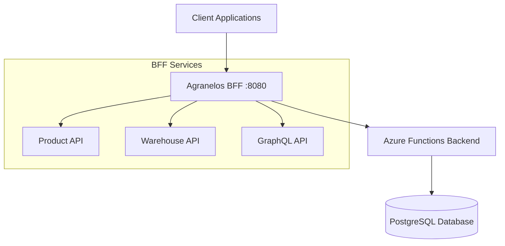

# Agranelos BFF (Backend For Frontend)

A comprehensive Backend For Frontend service built with Spring Boot that provides REST and GraphQL APIs for the Agranelos inventory management system. The BFF orchestrates calls to serverless Azure Functions and delivers enhanced warehouse management capabilities.

## Overview

This BFF service acts as an intermediary layer between client applications and Azure Functions backend, providing:

- **Dual API Support**: Both REST and GraphQL endpoints
- **Enhanced Warehouse Management**: Intelligent product handling during warehouse deletion
- **Comprehensive Validation**: Automatic validation with detailed error responses
- **Containerized Deployment**: Full Docker/Podman support
- **Extensive Testing**: Complete Postman collection with workflow examples

## Quick Start

### Prerequisites
- Java 17+
- Maven 3.6+
- Access to Azure Functions backend

### Running Locally
```bash
# Set environment variables
export AZURE_FUNCTIONS_BASE_URL="https://your-functions.azurewebsites.net/api"

# Run application
mvn spring-boot:run
```

### Using Containers (Recommended)
```bash
# Build and run with Podman Compose
podman compose up --build
```

## API Endpoints

### Products
- `GET /api/productos` - List all products
- `GET /api/productos/{id}` - Get product by ID
- `POST /api/productos` - Create new product
- `PUT /api/productos/{id}` - Update product
- `DELETE /api/productos/{id}` - Delete product

### Warehouses (Enhanced)
- `GET /api/bodegas` - List all warehouses
- `GET /api/bodegas/{id}` - Get warehouse by ID
- `GET /api/bodegas/{id}/productos` - List products in warehouse
- `POST /api/bodegas` - Create new warehouse
- `PUT /api/bodegas/{id}` - Update warehouse
- `DELETE /api/bodegas/{id}` - Delete warehouse (with validation)
- `DELETE /api/bodegas/{id}?force=true` - Force delete with details

### GraphQL
- `GET /api/graphql` - GraphQL endpoint information
- `POST /api/graphql` - Execute GraphQL queries

## Architecture



## Key Features

### Enhanced Warehouse Management
- **Safe Deletion**: Automatic validation prevents accidental data loss
- **Forced Deletion**: Override validation with detailed impact reporting
- **Product Consultation**: Query warehouse contents before operations
- **Detailed Responses**: Comprehensive information about affected products

### Validation and Safety
- Automatic product validation during warehouse deletion
- Detailed conflict responses with actionable information
- Optional force parameters for emergency operations
- Complete audit trail of affected resources

## Documentation

Comprehensive documentation is available in the `/docs` directory:

### API Documentation
- [Endpoints Mapping](docs/api/endpoints-mapping.md) - Complete endpoint mapping and implementation details
- [Warehouse Management](docs/api/warehouse-management.md) - Enhanced warehouse deletion functionality
- [Examples and Usage](docs/api/examples.md) - Practical examples and integration patterns

### Development Guide
- [Setup and Configuration](docs/development/setup.md) - Local development setup and configuration
- [Docker Deployment](docs/development/docker.md) - Container-based deployment guide

### Testing Resources
- [Postman Collection](docs/testing/postman.md) - Comprehensive API testing with Postman
- [Test Scripts](docs/testing/test-scripts.md) - Automated testing scripts and workflows

## Configuration

### Environment Variables
```bash
AZURE_FUNCTIONS_BASE_URL=https://your-functions.azurewebsites.net/api
SPRING_SECURITY_USER_NAME=user
SPRING_SECURITY_USER_PASSWORD=your-secure-password
```

### Application Properties
```yaml
server:
  port: 8080

azure:
  functions:
    base-url: ${AZURE_FUNCTIONS_BASE_URL}
```

## Testing

### Postman Collection
Import the complete Postman collection with 20+ requests organized in workflow examples:

1. Import `Agranelos-BFF.postman_collection.json`
2. Select appropriate environment from `postman/` directory
3. Execute workflow examples for warehouse management

### Automated Testing
```bash
# Run comprehensive test suite
./test-nuevas-funcionalidades.sh
```

## Container Deployment

### Using Podman Compose (Recommended)
```bash
# Start services
podman compose up -d

# View logs
podman compose logs -f

# Stop services
podman compose down
```

### Using Podman Play Kube
```bash
# Deploy with Kubernetes manifest
podman play kube k8s-deployment.yml
```

## Development

### Project Structure
```
agranelos-bff/
├── src/main/java/com/agranelos/bff/
│   ├── controller/          # REST Controllers
│   ├── dto/                 # Data Transfer Objects  
│   ├── config/              # Configuration classes
│   └── exception/           # Exception handlers
├── docs/                    # Documentation (Jekyll)
├── postman/                 # Postman environments
└── compose.yml              # Container orchestration
```

### Build
```bash
mvn clean package
```

### Health Checks
- **Health**: `GET /actuator/health`
- **Info**: `GET /actuator/info`

## Contributing

1. Follow Spring Boot conventions
2. Add tests for new functionality
3. Update documentation in `/docs`
4. Test with provided Postman collection

## Technology Stack

- **Runtime**: Java 17, Spring Boot 3.x
- **Build**: Maven
- **Containers**: Podman/Docker
- **Backend**: Azure Functions
- **Database**: PostgreSQL (via Azure Functions)
- **Documentation**: Jekyll (GitHub Pages compatible)

## License

This project is licensed under the MIT License - see the LICENSE file for details.

## Support

For detailed documentation and examples, visit the [documentation site](docs/) or review the comprehensive Postman collection included in this repository.