# ARQUITECTURA COMPLETA - SISTEMA DE INVENTARIO AGRANELOS
## Documento Final para Sumativa 3

---

## DIAGRAMA DE ARQUITECTURA COMPLETO

```mermaid
graph TB
    subgraph "CAPA DE CLIENTE"
        WEB[Web App<br/>React/Vue/Angular]
        MOBILE[Mobile App<br/>iOS/Android]
        POSTMAN[Postman/API Client]
    end
    
    subgraph "CAPA DE MICROSERVICIOS"
        BFF[BFF Microservice<br/>Spring Boot 3.x<br/>Port: 8080]
        style BFF fill:#4CAF50,stroke:#333,stroke-width:3px
    end
    
    subgraph "AZURE CLOUD"
        subgraph "CAPA DE FUNCIONES SERVERLESS"
            subgraph "REST APIs"
                FA1[GetProductos<br/>GET /api/productos]
                FA2[GetProductoById<br/>GET /api/productos/:id]
                FA3[CreateProducto<br/>POST /api/productos]
                FA4[UpdateProducto<br/>PUT /api/productos/:id]
                FA5[DeleteProducto<br/>DELETE /api/productos/:id]
                FA6[GetBodegas<br/>GET /api/bodegas]
                FA7[GetBodegaById<br/>GET /api/bodegas/:id]
                FA8[CreateBodega<br/>POST /api/bodegas]
                FA9[UpdateBodega<br/>PUT /api/bodegas/:id]
                FA10[DeleteBodega<br/>DELETE /api/bodegas/:id]
            end
            
            subgraph "GraphQL API"
                FG[GraphQL Endpoint<br/>POST /api/graphql<br/>Queries + Mutations]
            end
            
            subgraph "Utilities"
                FU[InitializeDatabase<br/>POST /api/init]
            end
        end
        
        subgraph "CAPA DE EVENTOS"
            EG[Azure Event Grid<br/>Event Bus<br/>Topic: agranelos-eventgrid-topic]
            style EG fill:#2196F3,stroke:#333,stroke-width:3px
            
            subgraph "Event Handlers"
                EH1[ProductoCreatedHandler<br/>Event Grid Trigger]
                EH2[ProductoUpdatedHandler<br/>Event Grid Trigger]
                EH3[ProductoDeletedHandler<br/>Event Grid Trigger]
                EH4[BodegaCreatedHandler<br/>Event Grid Trigger]
                EH5[BodegaUpdatedHandler<br/>Event Grid Trigger]
                EH6[BodegaDeletedHandler<br/>Event Grid Trigger]
            end
        end
        
        subgraph "CAPA DE MONITOREO"
            AI[Application Insights<br/>Logs, Metrics, Traces]
        end
    end
    
    subgraph "CAPA DE DATOS"
        DB[(PostgreSQL Database<br/>Tables: producto, bodega)]
        style DB fill:#FF9800,stroke:#333,stroke-width:3px
    end
    
    subgraph "SERVICIOS EXTERNOS"
        EMAIL[SendGrid<br/>Email Service]
    end
    
    subgraph "INFRAESTRUCTURA"
        ARM[ARM Templates<br/>IaC]
        CICD[GitHub Actions<br/>CI/CD]
    end
    
    %% Conexiones Cliente ‚Üí BFF
    WEB --> BFF
    MOBILE --> BFF
    POSTMAN --> BFF
    
    %% Conexiones BFF ‚Üí Azure Functions
    BFF --> FA1
    BFF --> FA2
    BFF --> FA3
    BFF --> FA4
    BFF --> FA5
    BFF --> FA6
    BFF --> FA7
    BFF --> FA8
    BFF --> FA9
    BFF --> FA10
    BFF --> FG
    
    %% Conexiones Functions ‚Üí Database
    FA1 --> DB
    FA2 --> DB
    FA3 --> DB
    FA4 --> DB
    FA5 --> DB
    FA6 --> DB
    FA7 --> DB
    FA8 --> DB
    FA9 --> DB
    FA10 --> DB
    FG --> DB
    FU --> DB
    
    %% Conexiones Functions ‚Üí Event Grid (Publishers)
    FA3 -.Publish Event.-> EG
    FA4 -.Publish Event.-> EG
    FA5 -.Publish Event.-> EG
    FA8 -.Publish Event.-> EG
    FA9 -.Publish Event.-> EG
    FA10 -.Publish Event.-> EG
    
    %% Conexiones Event Grid ‚Üí Handlers (Subscribers)
    EG --> EH1
    EG --> EH2
    EG --> EH3
    EG --> EH4
    EG --> EH5
    EG --> EH6
    
    %% Conexiones Handlers ‚Üí Email
    EH1 --> EMAIL
    EH2 --> EMAIL
    EH3 --> EMAIL
    EH4 --> EMAIL
    EH5 --> EMAIL
    EH6 --> EMAIL
    
    %% Conexiones Monitoreo
    BFF -.Logs.-> AI
    FA1 -.Telemetry.-> AI
    FA3 -.Telemetry.-> AI
    EH1 -.Telemetry.-> AI
    
    %% Infraestructura
    ARM -.Deploy.-> BFF
    ARM -.Deploy.-> EG
    CICD -.Deploy.-> FA1
```



---

## COMPONENTES DEL SISTEMA

### 1. CAPA DE CLIENTE
Cliente final que consume las APIs del sistema.

**Componentes**:
- **Web App**: Aplicación web (React/Vue/Angular)
- **Mobile App**: Aplicación móvil (iOS/Android)
- **API Clients**: Postman, curl, herramientas de testing

**Protocolo**: HTTP/HTTPS  
**Formato**: JSON

---

### 2. CAPA DE MICROSERVICIOS (BFF)

#### Backend for Frontend (Spring Boot)
**Propósito**: Orquestar y agregar llamadas a múltiples Azure Functions

**Características**:
- Desarrollado con Spring Boot 3.x
- Expone API REST unificada
- WebClient para llamadas asíncronas
- Circuit breaker (Resilience4j)
- Retry logic y timeouts
- Manejo centralizado de errores
- Health checks con Actuator
- Logging estructurado

**Endpoints Principales**:
```
GET    /api/v1/productos
GET    /api/v1/productos/{id}
POST   /api/v1/productos
PUT    /api/v1/productos/{id}
DELETE /api/v1/productos/{id}
GET    /api/v1/bodegas
POST   /api/v1/bodegas
GET    /actuator/health
```

**Tecnologías**:
- Spring Boot 3.x
- Spring WebFlux
- Resilience4j
- Spring Actuator
- Maven

**Puerto**: 8080  
**Docker**: Containerizado

---

### 3. CAPA DE FUNCIONES SERVERLESS (Azure Functions)

#### A) REST APIs (10 Functions)

##### **Productos** (5 Functions)

1. **GetProductos**
   - Método: GET
   - Endpoint: `/api/productos`
   - Función: Listar todos los productos
   - Response: JSON Array

2. **GetProductoById**
   - Método: GET
   - Endpoint: `/api/productos/{id}`
   - Función: Obtener producto específico
   - Response: JSON Object

3. **CreateProducto**
   - Método: POST
   - Endpoint: `/api/productos`
   - Función: Crear nuevo producto
   - Body: JSON con datos del producto
   - Event: Publica `ProductoCreado` a Event Grid

4. **UpdateProducto**
   - Método: PUT
   - Endpoint: `/api/productos/{id}`
   - Función: Actualizar producto existente
   - Event: Publica `ProductoActualizado` a Event Grid

5. **DeleteProducto**
   - Método: DELETE
   - Endpoint: `/api/productos/{id}`
   - Función: Eliminar producto
   - Event: Publica `ProductoEliminado` a Event Grid

##### **Bodegas** (5 Functions)

6. **GetBodegas**
   - Método: GET
   - Endpoint: `/api/bodegas`
   - Función: Listar todas las bodegas

7. **GetBodegaById**
   - Método: GET
   - Endpoint: `/api/bodegas/{id}`
   - Función: Obtener bodega específica

8. **CreateBodega**
   - Método: POST
   - Endpoint: `/api/bodegas`
   - Función: Crear nueva bodega
   - Event: Publica `BodegaCreada` a Event Grid

9. **UpdateBodega**
   - Método: PUT
   - Endpoint: `/api/bodegas/{id}`
   - Función: Actualizar bodega existente
   - Event: Publica `BodegaActualizada` a Event Grid

10. **DeleteBodega**
    - Método: DELETE
    - Endpoint: `/api/bodegas/{id}`
    - Función: Eliminar bodega
    - Event: Publica `BodegaEliminada` a Event Grid

#### B) GraphQL API (1 Function)

**GraphQLEndpoint**
- Método: POST
- Endpoint: `/api/graphql`
- Función: Ejecutar queries y mutations GraphQL

**Queries Disponibles**:
```graphql
# Query básica para obtener todos los productos
query {
  productos {
    id
    nombre
    descripcion
    precio
    cantidadEnStock
    fechaCreacion
    fechaActualizacion
  }
}

# Query para obtener un producto específico
query {
  producto(id: 1) {
    id
    nombre
    descripcion
    precio
    cantidadEnStock
  }
}

# Query con variables
query GetProducto($id: Int!) {
  producto(id: $id) {
    id
    nombre
    descripcion
    precio
    cantidadEnStock
  }
}

# Query para obtener todas las bodegas
query {
  bodegas {
    id
    nombre
    ubicacion
    capacidad
  }
}

# Query para obtener una bodega específica
query {
  bodega(id: 1) {
    id
    nombre
    ubicacion
    capacidad
  }
}
```

**Mutations Disponibles**:
```graphql
# Crear un nuevo producto
mutation {
  crearProducto(input: {
    nombre: "Laptop Dell"
    descripcion: "Laptop para desarrollo"
    precio: 899.99
    cantidadEnStock: 5
  }) {
    id
    nombre
    precio
  }
}

# Actualizar un producto con valores literales
mutation {
  actualizarProducto(id: 1, input: {
    nombre: "Laptop Dell Actualizada"
    descripcion: "Laptop para desarrollo y gaming"
    precio: 999.99
    cantidadEnStock: 3
  }) {
    id
    nombre
    precio
  }
}

# Actualizar un producto con variables
mutation UpdateProducto($id: Int!, $input: ProductoInput!) {
  actualizarProducto(id: $id, input: $input) {
    id
    nombre
    precio
    cantidadEnStock
  }
}

# Eliminar un producto
mutation {
  eliminarProducto(id: 1)
}

# Crear una nueva bodega
mutation {
  crearBodega(input: {
    nombre: "Almacén Central"
    ubicacion: "Santiago, Chile"
    capacidad: 1000
  }) {
    id
    nombre
    ubicacion
  }
}

# Actualizar una bodega
mutation {
  actualizarBodega(id: 1, input: {
    nombre: "Almacén Central Renovado"
    ubicacion: "Santiago Centro, Chile"
    capacidad: 1500
  }) {
    id
    nombre
    ubicacion
    capacidad
  }
}

# Eliminar una bodega
mutation {
  eliminarBodega(id: 2)
}
```

**Ejemplos de Variables para GraphQL**:

Para usar las queries y mutations con variables, se deben incluir las variables por separado:

```json
// Variables para query GetProducto
{
  "id": 1
}

// Variables para mutation UpdateProducto
{
  "id": 1,
  "input": {
    "nombre": "Producto Actualizado",
    "descripcion": "Nueva descripción",
    "precio": 149.99,
    "cantidadEnStock": 25
  }
}
```

#### C) Utilities (1 Function)

**InitializeDatabase**
- Método: POST
- Endpoint: `/api/init`
- Función: Crear tablas en PostgreSQL
- Schema: productos, bodegas

---

### 4. CAPA DE EVENTOS (Azure Event Grid)

#### Event Grid Topic
**Nombre**: `agranelos-eventgrid-topic`  
**Tipo**: Custom Topic  
**Región**: Same as Function App

#### Event Publishers (6 Functions)
Las siguientes Functions publican eventos:
- CreateProducto
- UpdateProducto
- DeleteProducto
- CreateBodega
- UpdateBodega
- DeleteBodega

#### Event Types

| Event Type | Data Schema | Trigger |
|------------|-------------|---------|
| `Agranelos.Inventario.ProductoCreado` | Producto JSON | POST /api/productos |
| `Agranelos.Inventario.ProductoActualizado` | Producto JSON | PUT /api/productos/{id} |
| `Agranelos.Inventario.ProductoEliminado` | {id: int} | DELETE /api/productos/{id} |
| `Agranelos.Inventario.BodegaCreada` | Bodega JSON | POST /api/bodegas |
| `Agranelos.Inventario.BodegaActualizada` | Bodega JSON | PUT /api/bodegas/{id} |
| `Agranelos.Inventario.BodegaEliminada` | {id: int} | DELETE /api/bodegas/{id} |

#### Event Handlers (6 Azure Functions)

1. **ProductoCreatedHandler**
   - Trigger: Event Grid
   - Event Type: `Agranelos.Inventario.ProductoCreado`
   - Actions:
     - Log evento
     - Enviar email de notificación
     - Actualizar cache
     - Sincronizar sistemas

2. **ProductoUpdatedHandler**
   - Trigger: Event Grid
   - Event Type: `Agranelos.Inventario.ProductoActualizado`
   - Actions:
     - Log cambios
     - Notificar stakeholders
     - Invalidar cache

3. **ProductoDeletedHandler**
   - Trigger: Event Grid
   - Event Type: `Agranelos.Inventario.ProductoEliminado`
   - Actions:
     - Log eliminación
     - Archivar datos
     - Notificar eliminación

4. **BodegaCreatedHandler**
   - Trigger: Event Grid
   - Event Type: `Agranelos.Inventario.BodegaCreada`
   - Actions:
     - Log creación
     - Enviar notificación
     - Configurar bodega default

5. **BodegaUpdatedHandler**
   - Trigger: Event Grid
   - Event Type: `Agranelos.Inventario.BodegaActualizada`
   - Actions:
     - Log actualización
     - Notificar cambios

6. **BodegaDeletedHandler**
   - Trigger: Event Grid
   - Event Type: `Agranelos.Inventario.BodegaEliminada`
   - Actions:
     - Log eliminación
     - Reasignar productos a bodega default
     - Notificar administradores

---

### 5. CAPA DE DATOS (PostgreSQL)

#### Modelo de Datos

**Tabla: producto**
```sql
CREATE TABLE producto (
    id SERIAL PRIMARY KEY,
    nombre VARCHAR(255) NOT NULL,
    descripcion TEXT,
    precio DECIMAL(10, 2) NOT NULL,
    cantidad_en_stock INTEGER NOT NULL DEFAULT 0,
    fecha_creacion TIMESTAMP DEFAULT CURRENT_TIMESTAMP,
    fecha_actualizacion TIMESTAMP DEFAULT CURRENT_TIMESTAMP
);
```

**Tabla: bodega**
```sql
CREATE TABLE bodega (
    id SERIAL PRIMARY KEY,
    nombre VARCHAR(255) NOT NULL UNIQUE,
    ubicacion VARCHAR(255),
    capacidad INTEGER NOT NULL,
    fecha_creacion TIMESTAMP DEFAULT CURRENT_TIMESTAMP,
    fecha_actualizacion TIMESTAMP DEFAULT CURRENT_TIMESTAMP
);
```

#### Connection Pooling
- **Library**: HikariCP
- **Max Pool Size**: 10
- **Min Idle**: 2
- **Connection Timeout**: 30s

---

### 6. CAPA DE SERVICIOS EXTERNOS

#### SendGrid (Email Service)
**Función**: Envío de notificaciones por email

**Eventos que disparan emails**:
- ProductoCreado
- ProductoActualizado
- ProductoEliminado
- BodegaCreada
- BodegaActualizada
- BodegaEliminada

**Configuración**:
```java
// En Event Handlers
SendGrid sg = new SendGrid(System.getenv("SENDGRID_API_KEY"));
Request request = new Request();
request.setMethod(Method.POST);
request.setEndpoint("mail/send");

Mail mail = new Mail(from, subject, to, content);
request.setBody(mail.build());

Response response = sg.api(request);
```

---

### 7. CAPA DE MONITOREO

#### Application Insights
**Función**: Telemetría, logs, métricas y traces

**Métricas Capturadas**:
- Request count
- Response times
- Success/failure rates
- Exception tracking
- Custom events
- Dependencies
- Performance counters

**Queries Útiles**:
```kusto
// Ver requests recientes
requests
| where timestamp > ago(1h)
| order by timestamp desc

// Ver errores
exceptions
| where timestamp > ago(24h)
| project timestamp, type, outerMessage

// Performance de functions
requests
| summarize avg(duration), count() by name
| order by avg_duration desc
```

---

### 8. INFRAESTRUCTURA COMO CÓDIGO

#### ARM Templates
**Archivos**:
- `azure-deploy.json` - Template principal
- `azure-deploy.parameters.json` - Parámetros

**Recursos Definidos**:
```json
{
  "resources": [
    {
      "type": "Microsoft.Web/sites",
      "name": "agranelos-inventario-functions"
    },
    {
      "type": "Microsoft.EventGrid/topics",
      "name": "agranelos-eventgrid-topic"
    },
    {
      "type": "Microsoft.Storage/storageAccounts",
      "name": "agranelosfunctionsstore"
    },
    {
      "type": "Microsoft.Insights/components",
      "name": "agranelos-inventario-insights"
    }
  ]
}
```

#### CI/CD con GitHub Actions
**Workflow**: `.github/workflows/azure-functions.yml`

**Pasos**:
1. Checkout code
2. Setup Java 11
3. Build with Maven
4. Run tests
5. Deploy to Azure Functions
6. Verify deployment

---

## FLUJOS DE DATOS

### Flujo 1: Operación CRUD Simple (GET)

```
1. Cliente → Request: GET /api/v1/productos
2. BFF → Recibe request
3. BFF → Llama a Azure Function: GET /api/productos
4. Azure Function → Query a PostgreSQL
5. PostgreSQL → Retorna resultados
6. Azure Function → Formatea JSON
7. Azure Function → Retorna a BFF
8. BFF → Agrega/Transforma datos
9. BFF → Response al cliente
10. Azure Function → Log telemetry a App Insights
```

### Flujo 2: Operación CREATE con Eventos

```
1. Cliente → Request: POST /api/v1/productos
2. BFF → Recibe request + body JSON
3. BFF → Valida datos
4. BFF → Llama a Azure Function: POST /api/productos
5. Azure Function → Valida y sanitiza
6. Azure Function → INSERT en PostgreSQL
7. PostgreSQL → Retorna nuevo ID
8. Azure Function → Construye objeto Producto
9. Azure Function → Publica evento a Event Grid
   {
     "eventType": "Agranelos.Inventario.ProductoCreado",
     "subject": "producto/123",
     "data": { ...producto... }
   }
10. Event Grid → Recibe evento
11. Event Grid → Distribuye a subscribers
12. ProductoCreatedHandler → Procesa evento
    - Log en App Insights
    - Envía email via SendGrid
    - Actualiza sistemas
13. Azure Function → Response 201 Created
14. BFF → Retorna respuesta al cliente
```

### Flujo 3: Query GraphQL

```
1. Cliente → POST /api/graphql
   Body: { "query": "{ productos { id nombre precio } }" }
2. BFF/Cliente → Llama directamente a GraphQL Function
3. GraphQL Function → Parse query
4. GraphQL Function → Resolve fields
5. GraphQL Function → Query PostgreSQL
6. PostgreSQL → Retorna datos
7. GraphQL Function → Construye response GraphQL
8. GraphQL Function → Retorna JSON
   {
     "data": {
       "productos": [...]
     }
   }
```

### Flujo 4: Event Handler Processing

```
1. Event Grid → Trigger: ProductoCreatedHandler
2. Handler → Recibe evento JSON
3. Handler → Parse event data
4. Handler → Log "Producto X creado"
5. Handler → Construye email
6. Handler → Llama SendGrid API
7. SendGrid → Envía email
8. Handler → Log "Email enviado"
9. Handler → Actualiza cache (opcional)
10. Handler → Termina ejecución
11. Handler → Telemetry a App Insights
```

---

## MÉTRICAS DEL SISTEMA

### Recursos Azure Desplegados

| Recurso | Tipo | Cantidad | Propósito |
|---------|------|----------|-----------|
| Azure Functions App | Compute | 1 | Host de 18 functions |
| App Service Plan | Compute | 1 | Consumption (Serverless) |
| Event Grid Topic | Messaging | 1 | Event bus |
| Storage Account | Storage | 1 | Function artifacts |
| Application Insights | Monitoring | 1 | Telemetry |
| PostgreSQL Database | Database | 1 | Data persistence |

### Funciones Implementadas

| Categoría | Cantidad | Detalles |
|-----------|----------|----------|
| REST APIs | 10 | CRUD completo |
| GraphQL APIs | 1 | Queries + Mutations |
| Event Handlers | 6 | Procesamiento asíncrono |
| Utilities | 1 | Database init |
| **TOTAL** | **18** | Functions |

### Eventos

| Evento | Publishers | Subscribers |
|--------|-----------|-------------|
| ProductoCreado | 1 | 1 |
| ProductoActualizado | 1 | 1 |
| ProductoEliminado | 1 | 1 |
| BodegaCreada | 1 | 1 |
| BodegaActualizada | 1 | 1 |
| BodegaEliminada | 1 | 1 |
| **TOTAL** | **6** | **6** |

---

## SEGURIDAD

### Autenticación y Autorización
- API Keys para Event Grid
- Connection strings cifradas
- Variables de entorno para secrets
- Azure Key Vault (recomendado para prod)

### Red y Conectividad
- HTTPS en todos los endpoints
- CORS configurado
- Rate limiting en BFF
- Input validation

### Datos
- SQL injection prevention (PreparedStatements)
- Input sanitization
- Output encoding
- Connection pooling seguro

---

## ESCALABILIDAD

### Azure Functions
- **Tipo**: Consumption Plan
- **Auto-scaling**: Automático según carga
- **Cold start**: ~2-3 segundos
- **Max instances**: 200 (default)

### BFF Microservice
- **Containerizado**: Docker
- **Escalado horizontal**: Kubernetes-ready
- **Circuit breaker**: Protección contra fallos
- **Retry logic**: Reintentos automáticos

### Database
- **Connection pooling**: HikariCP (10 max connections)
- **Índices**: En campos de búsqueda frecuente
- **Caching**: Posible con Redis (futuro)

---

## MONITOREO Y OBSERVABILIDAD

### Application Insights

**Métricas Clave**:
- Requests per second
- Average response time
- Success rate
- Exception count
- Dependency calls

**Dashboards**:
- Overview general
- Performance por function
- Failures y errores
- Mapa de aplicación
- Transacciones end-to-end

### Logging

**Niveles**:
- INFO: Operaciones normales
- WARNING: Situaciones anómalas
- ERROR: Fallos recuperables
- CRITICAL: Fallos críticos

**Structured Logging**:
```java
context.getLogger().info(String.format(
    "Operation: %s | Resource: %s | Duration: %dms | Status: %s",
    "CreateProducto", 
    "producto/" + id, 
    duration, 
    "success"
));
```

---

## 🔧 TECNOLOGÍAS UTILIZADAS

### Backend (BFF)
- Java 11
- Spring Boot 3.x
- Spring WebFlux
- Resilience4j
- Maven

### Serverless (Azure Functions)
- Java 11
- Azure Functions Runtime 4.x
- Maven
- azure-functions-maven-plugin

### Datos
- PostgreSQL 13+
- HikariCP (Connection Pooling)
- JDBC

### Eventos
- Azure Event Grid
- azure-messaging-eventgrid SDK

### APIs
- REST (JSON)
- GraphQL (graphql-java)
- Jackson (JSON serialization)

### Monitoreo
- Application Insights
- SendGrid (Email)

### DevOps
- Docker
- Docker Compose
- GitHub Actions
- ARM Templates

### Testing
- JUnit 5
- Mockito
- Postman
- Bash scripts

---

## CONCLUSIÓN

El Sistema de Inventario Agranelos implementa una arquitectura cloud-native moderna que combina:

1. **Microservicios** (Spring Boot BFF)
2. **Serverless** (18 Azure Functions)
3. **Event-Driven** (Azure Event Grid)
4. **APIs Duales** (REST + GraphQL)
5. **Containerización** (Docker)
6. **CI/CD** (GitHub Actions)
7. **IaC** (ARM Templates)
8. **Observabilidad** (Application Insights)

Esta arquitectura proporciona:
- Alta escalabilidad
- Bajo costo operacional (Serverless)
- Alta disponibilidad
- Procesamiento asíncrono
- Fácil mantenimiento
- Despliegue automatizado

---

**Documento de Arquitectura Final - Sumativa 3**  
**Sistema de Inventario Agranelos**  
**Octubre 2025**
