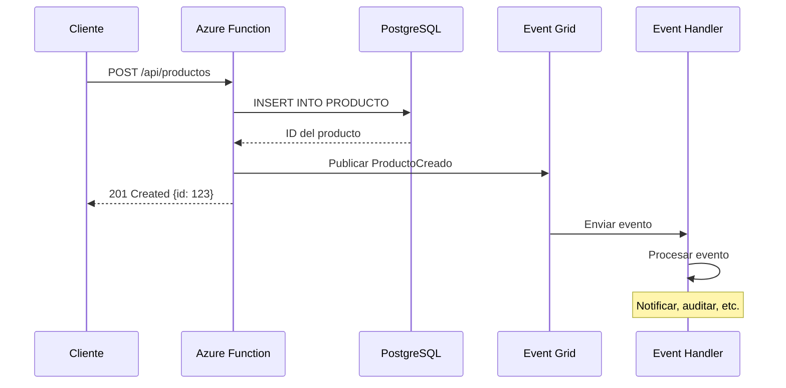
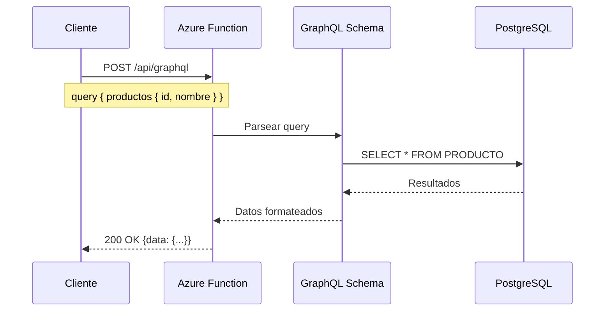
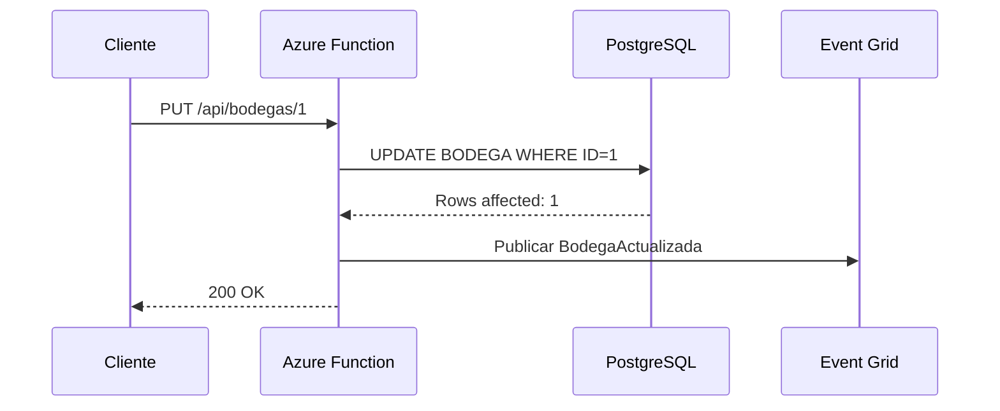

# 🏗️ Arquitectura del Sistema de Inventario Agranelos

## Índice
1. [Visión General](#visión-general)
2. [Componentes del Sistema](#componentes-del-sistema)
3. [Arquitectura Orientada a Eventos](#arquitectura-orientada-a-eventos)
4. [Flujos de Datos](#flujos-de-datos)
5. [Diagrama de Arquitectura](#diagrama-de-arquitectura)
6. [Despliegue en Azure](#despliegue-en-azure)
7. [Seguridad](#seguridad)
8. [Monitoreo y Observabilidad](#monitoreo-y-observabilidad)

---

## Visión General

El Sistema de Inventario Agranelos es una solución cloud-native basada en **Azure Functions** (serverless) que implementa una **arquitectura orientada a eventos** utilizando **Azure Event Grid**. El sistema proporciona APIs duales (REST y GraphQL) para gestionar productos, bodegas e inventario.

### Características Principales

- ✅ **Serverless**: Azure Functions con escalado automático
- ✅ **Event-Driven**: Azure Event Grid para comunicación asíncrona
- ✅ **APIs Duales**: REST y GraphQL en la misma infraestructura
- ✅ **Base de Datos**: PostgreSQL con conexiones pooling (HikariCP)
- ✅ **CI/CD**: Despliegue automatizado con GitHub Actions
- ✅ **Observabilidad**: Application Insights para monitoreo
- ✅ **Infraestructura como Código**: ARM Templates

---

## Componentes del Sistema

### 1. Capa de Presentación (Frontend - Externo)
```
┌─────────────────────────────────────┐
│   Aplicaciones Cliente              │
│   - Web App (React/Vue/Angular)     │
│   - Mobile App (iOS/Android)        │
│   - Postman/API Testing Tools       │
└─────────────────────────────────────┘
```

### 2. Capa de API Gateway (Opcional - BFF)
```
┌─────────────────────────────────────┐
│   Backend for Frontend (BFF)        │
│   - Orquestación de llamadas        │
│   - Transformación de datos         │
│   - Agregación de respuestas        │
└─────────────────────────────────────┘
```

### 3. Capa de Funciones Serverless (Core)
```
┌─────────────────────────────────────────────────────┐
│   Azure Functions (Java 11)                          │
│   ┌─────────────────┐  ┌──────────────────┐        │
│   │   REST API      │  │   GraphQL API    │        │
│   │   /productos    │  │   /graphql       │        │
│   │   /bodegas      │  │                  │        │
│   └─────────────────┘  └──────────────────┘        │
│                                                      │
│   CRUD Operations:                                   │
│   - GetProductos / GetProductoById                   │
│   - CreateProducto / UpdateProducto / DeleteProducto │
│   - GetBodegas / GetBodegaById                       │
│   - CreateBodega / UpdateBodega / DeleteBodega       │
│   - InitializeDatabase                               │
└─────────────────────────────────────────────────────┘
```

### 4. Capa de Eventos (Event-Driven Architecture)
```
┌─────────────────────────────────────────────────────┐
│   Azure Event Grid                                   │
│   ┌──────────────────────────────────────────────┐ │
│   │  Event Topic: agranelos-eventgrid-topic      │ │
│   │                                               │ │
│   │  Tipos de Eventos:                           │ │
│   │  - Agranelos.Inventario.ProductoCreado       │ │
│   │  - Agranelos.Inventario.ProductoActualizado  │ │
│   │  - Agranelos.Inventario.ProductoEliminado    │ │
│   │  - Agranelos.Inventario.BodegaCreada         │ │
│   │  - Agranelos.Inventario.BodegaActualizada    │ │
│   │  - Agranelos.Inventario.BodegaEliminada      │ │
│   └──────────────────────────────────────────────┘ │
└─────────────────────────────────────────────────────┘
```

### 5. Event Handlers (Consumidores)
```
┌─────────────────────────────────────────────────────┐
│   Event Grid Trigger Functions                       │
│   - ProductoCreadoEventHandler                       │
│   - ProductoActualizadoEventHandler                  │
│   - ProductoEliminadoEventHandler                    │
│   - BodegaCreadaEventHandler                         │
│   - BodegaActualizadaEventHandler                    │
│   - BodegaEliminadaEventHandler                      │
│                                                      │
│   Casos de Uso:                                      │
│   - Notificaciones (Email/SMS)                       │
│   - Auditoría y logging                              │
│   - Sincronización con sistemas externos             │
│   - Actualización de cachés                          │
│   - Generación de reportes                           │
└─────────────────────────────────────────────────────┘
```

### 6. Capa de Datos
```
┌─────────────────────────────────────────────────────┐
│   PostgreSQL Database (AWS EC2)                      │
│   ┌──────────────────────────────────────────────┐ │
│   │  Tablas:                                      │ │
│   │  - PRODUCTO (ID, Nombre, Precio, Stock...)   │ │
│   │  - BODEGA (ID, Nombre, Ubicación...)         │ │
│   │  - INVENTARIO (IDProducto, IDBodega...)      │ │
│   │  - MOVIMIENTO (Tipo, Cantidad, Fecha...)     │ │
│   └──────────────────────────────────────────────┘ │
│                                                      │
│   Connection Pooling: HikariCP                       │
└─────────────────────────────────────────────────────┘
```

### 7. Capa de Observabilidad
```
┌─────────────────────────────────────────────────────┐
│   Azure Application Insights                         │
│   - Métricas de rendimiento                          │
│   - Logs y trazabilidad                              │
│   - Alertas y notificaciones                         │
│   - Dashboard de monitoreo                           │
└─────────────────────────────────────────────────────┘
```

---

## Arquitectura Orientada a Eventos

### Flujo de Publicación de Eventos

```
┌─────────────┐      ┌──────────────┐      ┌──────────────┐
│   Client    │──1──▶│ Azure Func   │──2──▶│  Database    │
│   Request   │      │ (REST/GQL)   │      │  PostgreSQL  │
└─────────────┘      └──────────────┘      └──────────────┘
                            │
                            │ 3. Publicar Evento
                            ▼
                     ┌──────────────┐
                     │  Event Grid  │
                     │    Topic     │
                     └──────────────┘
                            │
                            │ 4. Distribuir Evento
              ┌─────────────┼─────────────┐
              ▼             ▼             ▼
    ┌─────────────┐ ┌─────────────┐ ┌─────────────┐
    │  Handler 1  │ │  Handler 2  │ │  Handler 3  │
    │ Notificar   │ │  Auditoría  │ │   Cache     │
    └─────────────┘ └─────────────┘ └─────────────┘
```

### Eventos del Sistema

#### Eventos de Productos
| Evento | Tipo | Descripción |
|--------|------|-------------|
| **ProductoCreado** | `Agranelos.Inventario.ProductoCreado` | Se dispara al crear un producto |
| **ProductoActualizado** | `Agranelos.Inventario.ProductoActualizado` | Se dispara al actualizar un producto |
| **ProductoEliminado** | `Agranelos.Inventario.ProductoEliminado` | Se dispara al eliminar un producto |

#### Eventos de Bodegas
| Evento | Tipo | Descripción |
|--------|------|-------------|
| **BodegaCreada** | `Agranelos.Inventario.BodegaCreada` | Se dispara al crear una bodega |
| **BodegaActualizada** | `Agranelos.Inventario.BodegaActualizada` | Se dispara al actualizar una bodega |
| **BodegaEliminada** | `Agranelos.Inventario.BodegaEliminada` | Se dispara al eliminar una bodega |

### Estructura de un Evento

```json
{
  "id": "unique-event-id",
  "eventType": "Agranelos.Inventario.ProductoCreado",
  "subject": "/productos/123",
  "eventTime": "2025-10-03T10:30:00Z",
  "dataVersion": "1.0",
  "data": {
    "productoId": 123,
    "nombre": "Arroz Premium",
    "descripcion": "Arroz de grano largo",
    "precio": "25.50",
    "cantidadEnStock": 100,
    "timestamp": "2025-10-03T10:30:00",
    "operation": "CREATE",
    "usuario": "system"
  }
}
```

---

## Flujos de Datos

### Flujo 1: Crear Producto (con Eventos)



### Flujo 2: Consulta GraphQL



### Flujo 3: Actualizar Bodega (con Eventos)



---

## Diagrama de Arquitectura

```
┏━━━━━━━━━━━━━━━━━━━━━━━━━━━━━━━━━━━━━━━━━━━━━━━━━━━━━━━━━━━┓
┃                    INTERNET / CLIENTES                      ┃
┃          Web Apps │ Mobile Apps │ API Clients               ┃
┗━━━━━━━━━━━━━━━━━━━━━━━━━━━┳━━━━━━━━━━━━━━━━━━━━━━━━━━━━━━━┛
                              │
                              │ HTTPS
                              ▼
┏━━━━━━━━━━━━━━━━━━━━━━━━━━━━━━━━━━━━━━━━━━━━━━━━━━━━━━━━━━━┓
┃                     AZURE CLOUD                             ┃
┃                                                             ┃
┃  ┌─────────────────────────────────────────────────────┐  ┃
┃  │       Azure Functions (Consumption Plan)            │  ┃
┃  │                                                      │  ┃
┃  │  ┌──────────────┐         ┌──────────────┐         │  ┃
┃  │  │  REST API    │         │  GraphQL API │         │  ┃
┃  │  │              │         │              │         │  ┃
┃  │  │ GetProductos │         │   Query &    │         │  ┃
┃  │  │ CreateProd.. │         │  Mutations   │         │  ┃
┃  │  │ UpdateProd.. │         │              │         │  ┃
┃  │  │ DeleteProd.. │         │              │         │  ┃
┃  │  │              │         │              │         │  ┃
┃  │  │ GetBodegas   │         │              │         │  ┃
┃  │  │ CreateBodega │         │              │         │  ┃
┃  │  │ UpdateBodega │         │              │         │  ┃
┃  │  │ DeleteBodega │         │              │         │  ┃
┃  │  └──────┬───────┘         └──────┬───────┘         │  ┃
┃  └─────────┼────────────────────────┼─────────────────┘  ┃
┃            │                        │                     ┃
┃            │  Publica Eventos       │                     ┃
┃            ▼                        ▼                     ┃
┃  ┌──────────────────────────────────────────────────┐   ┃
┃  │          Azure Event Grid Topic                   │   ┃
┃  │      agranelos-eventgrid-topic                    │   ┃
┃  │                                                    │   ┃
┃  │  Events:                                          │   ┃
┃  │  • ProductoCreado / Actualizado / Eliminado      │   ┃
┃  │  • BodegaCreada / Actualizada / Eliminada        │   ┃
┃  └──────────────────┬───────────────────────────────┘   ┃
┃                     │                                    ┃
┃                     │ Distribuye Eventos                 ┃
┃                     │                                    ┃
┃  ┌──────────────────┴───────────────────────────────┐   ┃
┃  │       Event Grid Trigger Functions                │   ┃
┃  │                                                    │   ┃
┃  │  • ProductoCreadoEventHandler                     │   ┃
┃  │  • ProductoActualizadoEventHandler                │   ┃
┃  │  • ProductoEliminadoEventHandler                  │   ┃
┃  │  • BodegaCreadaEventHandler                       │   ┃
┃  │  • BodegaActualizadaEventHandler                  │   ┃
┃  │  • BodegaEliminadaEventHandler                    │   ┃
┃  │                                                    │   ┃
┃  │  Acciones:                                        │   ┃
┃  │  - Notificaciones (Email/SMS)                     │   ┃
┃  │  - Auditoría y logging                            │   ┃
┃  │  - Sincronización externa                         │   ┃
┃  │  - Actualizar cachés                              │   ┃
┃  └────────────────────────────────────────────────────┘  ┃
┃                                                           ┃
┃  ┌────────────────────────────────────────────────────┐  ┃
┃  │        Azure Application Insights                   │  ┃
┃  │  - Telemetría                                       │  ┃
┃  │  - Logs                                             │  ┃
┃  │  - Métricas                                         │  ┃
┃  │  - Alertas                                          │  ┃
┃  └────────────────────────────────────────────────────┘  ┃
┃                                                           ┃
┃  ┌────────────────────────────────────────────────────┐  ┃
┃  │        Azure Storage Account                        │  ┃
┃  │  - Function App Storage                             │  ┃
┃  │  - Logs y configuración                             │  ┃
┃  └────────────────────────────────────────────────────┘  ┃
┗━━━━━━━━━━━━━━━━━━━━━━━━━┳━━━━━━━━━━━━━━━━━━━━━━━━━━━━━━━┛
                            │
                            │ JDBC Connection (Pooled)
                            ▼
┏━━━━━━━━━━━━━━━━━━━━━━━━━━━━━━━━━━━━━━━━━━━━━━━━━━━━━━━━━━━┓
┃                    AWS EC2 (External)                       ┃
┃                                                             ┃
┃  ┌────────────────────────────────────────────────────┐   ┃
┃  │         PostgreSQL Database                         │   ┃
┃  │         Host: 50.19.86.166:5432                     │   ┃
┃  │         DB: inventario_agranelos                    │   ┃
┃  │                                                      │   ┃
┃  │  Tables:                                            │   ┃
┃  │  ├─ PRODUCTO                                        │   ┃
┃  │  ├─ BODEGA                                          │   ┃
┃  │  ├─ INVENTARIO                                      │   ┃
┃  │  └─ MOVIMIENTO                                      │   ┃
┃  │                                                      │   ┃
┃  │  Connection Pool: HikariCP                          │   ┃
┃  └────────────────────────────────────────────────────┘   ┃
┗━━━━━━━━━━━━━━━━━━━━━━━━━━━━━━━━━━━━━━━━━━━━━━━━━━━━━━━━━━━┛
```

---

## Despliegue en Azure

### Opción 1: Despliegue con Script Bash

```bash
# Ejecutar el script de despliegue
./scripts/deploy-azure.sh
```

### Opción 2: Despliegue con ARM Template

```bash
# Crear el grupo de recursos
az group create \
  --name agranelos-inventario-rg \
  --location eastus

# Desplegar con ARM template
az deployment group create \
  --resource-group agranelos-inventario-rg \
  --template-file azure-deploy.json \
  --parameters azure-deploy.parameters.json
```

### Opción 3: Despliegue con Maven Plugin

```bash
# Compilar y desplegar
mvn clean package
mvn azure-functions:deploy
```

### Configuración Post-Despliegue

1. **Configurar Event Grid Subscriptions**
   - Crear suscripciones para cada tipo de evento
   - Apuntar a las funciones Event Handler correspondientes

2. **Configurar Application Insights**
   - Verificar que la instrumentación esté activa
   - Configurar alertas personalizadas

3. **Verificar Conectividad a Base de Datos**
   - Probar conexión desde Azure Functions a PostgreSQL
   - Verificar reglas de firewall si es necesario

4. **Configurar CORS** (si es necesario)
   - Agregar dominios permitidos en la configuración de Function App

---

## Seguridad

### 1. Autenticación y Autorización
- **Function Keys**: Protección de endpoints con claves de función
- **Azure AD Integration**: Autenticación con Azure Active Directory (opcional)
- **API Management**: Usar APIM para gestión avanzada de APIs

### 2. Seguridad de Datos
- **Conexiones HTTPS**: Todo el tráfico encriptado con TLS
- **Secrets en Key Vault**: Almacenar credenciales sensibles en Azure Key Vault
- **Connection Strings**: Nunca exponer en código fuente

### 3. Seguridad de Base de Datos
- **SSL/TLS**: Encriptar conexiones a PostgreSQL
- **Least Privilege**: Usuario de BD con permisos mínimos necesarios
- **Firewall Rules**: Restringir acceso por IP

### 4. Event Grid Security
- **Topic Keys**: Autenticación con claves para publicar eventos
- **Webhook Validation**: Validación de endpoints de suscripción
- **Event Filtering**: Filtrar eventos por tipo y propiedades

---

## Monitoreo y Observabilidad

### Métricas Clave

| Métrica | Descripción | Umbral |
|---------|-------------|--------|
| **Function Execution Count** | Número de ejecuciones | > 10,000/día |
| **Function Execution Time** | Tiempo promedio de ejecución | < 2 segundos |
| **Event Grid Delivery Success Rate** | % de eventos entregados | > 99% |
| **Database Connection Pool** | Conexiones activas | < 80% capacidad |
| **Error Rate** | % de solicitudes fallidas | < 1% |

### Logs y Trazabilidad

- **Application Insights**: Logs centralizados de todas las funciones
- **Event Grid Logs**: Historial de eventos publicados y entregados
- **Database Audit Logs**: Registro de operaciones en BD

### Alertas Configuradas

1. **Alta tasa de errores** (> 5% en 5 minutos)
2. **Tiempo de respuesta elevado** (> 5 segundos)
3. **Fallos en Event Grid** (> 10% eventos no entregados)
4. **Problemas de conexión a BD**

---

## Escalabilidad

### Azure Functions (Consumption Plan)
- **Auto-scaling**: Escala automáticamente basado en demanda
- **Límites**: Hasta 200 instancias concurrentes
- **Cold Start**: ~1-2 segundos (Java 11)

### Event Grid
- **Throughput**: Millones de eventos por segundo
- **Retry Policy**: Reintentos automáticos con backoff exponencial
- **Dead Letter Queue**: Eventos fallidos enviados a storage

### Database Connection Pooling
- **HikariCP**: Pool de conexiones eficiente
- **Max Pool Size**: 10 conexiones (configurable)
- **Connection Timeout**: 30 segundos

---

## Costos Estimados (Azure)

| Componente | Costo Mensual (Estimado) |
|------------|---------------------------|
| Azure Functions (Consumption) | $5 - $20 |
| Event Grid | $0.60 per millón eventos |
| Storage Account | $1 - $5 |
| Application Insights | $2.30 por GB de datos |
| **Total Estimado** | **$10 - $50/mes** |

*Nota: Los costos varían según el uso real y la región.*

---

## Conclusión

Esta arquitectura proporciona:

✅ **Escalabilidad**: Serverless con auto-scaling  
✅ **Resiliencia**: Event-driven con retry automático  
✅ **Flexibilidad**: APIs duales (REST + GraphQL)  
✅ **Observabilidad**: Monitoreo completo con App Insights  
✅ **Costo-eficiencia**: Pay-per-use con Consumption Plan  
✅ **Mantenibilidad**: Infraestructura como código  

El sistema está listo para producción y puede escalar según las necesidades del negocio.
