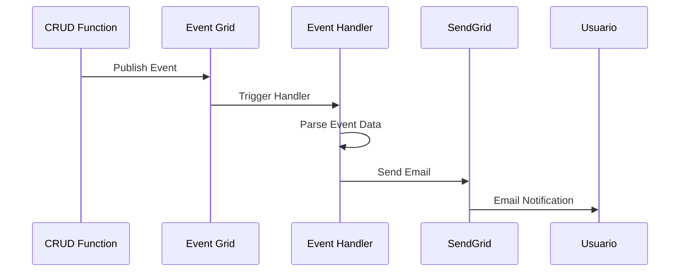

<link rel="stylesheet" href="https://diegobarrosa.github.io/diegobarrosaraya-assets/shared-theme.css">
<link rel="stylesheet" href="https://diegobarrosa.github.io/diegobarrosaraya-assets/shared-footer.css">
<script src="https://diegobarrosa.github.io/diegobarrosaraya-assets/shared-theme.js"></script>

# Configuracion de Notificaciones por Email

El sistema envia notificaciones automaticas por email cuando ocurren eventos en el inventario utilizando SendGrid.

## Arquitectura de Notificaciones



## Tipos de Notificaciones

| Evento | Asunto | Destinatario |
|--------|--------|--------------|
| ProductoCreado | Nuevo Producto Creado | Configurado en RECIPIENT_EMAIL |
| ProductoActualizado | Producto Actualizado | Configurado en RECIPIENT_EMAIL |
| ProductoEliminado | Producto Eliminado | Configurado en RECIPIENT_EMAIL |
| BodegaCreada | Nueva Bodega Creada | Configurado en RECIPIENT_EMAIL |
| BodegaActualizada | Bodega Actualizada | Configurado en RECIPIENT_EMAIL |
| BodegaEliminada | Bodega Eliminada | Configurado en RECIPIENT_EMAIL |

## Configuracion de SendGrid

### Paso 1: Crear Cuenta SendGrid

1. Ir a [https://signup.sendgrid.com/](https://signup.sendgrid.com/)
2. Crear una cuenta gratuita (100 emails/dia)
3. Verificar el email de registro

### Paso 2: Obtener API Key

1. Iniciar sesion en [https://app.sendgrid.com/](https://app.sendgrid.com/)
2. Ir a **Settings** → **API Keys**
3. Click en **Create API Key**
4. Nombre: `AgranelosInventario`
5. Permisos: **Full Access**
6. Guardar la API Key (comienza con `SG.`)

### Paso 3: Verificar Sender Email

1. En SendGrid, ir a **Settings** → **Sender Authentication**
2. Click en **Verify a Single Sender**
3. Completar el formulario:
   - From Name: `Sistema Inventario Agranelos`
   - From Email Address: Tu email personal
   - Reply To: El mismo email
   - Company Address: Direccion DuocUC
   - City, State, Zip, Country: Santiago, Chile
4. Click en **Create**
5. Verificar el email recibido en la bandeja de entrada
6. Click en el enlace de verificacion

### Paso 4: Configurar Variables de Entorno

#### Desarrollo Local (local.settings.json)

```json
{
  "Values": {
    "SENDGRID_API_KEY": "SG.xxxxxxxxxxxxxxxxxxxxxxxxxxxxxxxxxxxxxxxxxxxxxxxxxxxxxxxxxxxxxxxx",
    "SENDER_EMAIL": "tu-email-verificado@example.com",
    "RECIPIENT_EMAIL": "di.barros@duocuc.cl"
  }
}
```

#### Produccion (Azure Function App)

```bash
# Via Azure CLI
az functionapp config appsettings set \
  --name agranelos \
  --resource-group agranelos-inventario-rg \
  --settings \
    "SENDGRID_API_KEY=SG.xxxxxxxx" \
    "SENDER_EMAIL=tu-email-verificado@example.com" \
    "RECIPIENT_EMAIL=di.barros@duocuc.cl"
```

O via Azure Portal:
1. Ir a Function App
2. Configuration → Application settings
3. Agregar las 3 variables

## Implementacion Tecnica

### EmailService.java

El servicio de email se encuentra en `src/main/java/com/agranelos/inventario/services/EmailService.java`

Funciones principales:
- `sendProductoCreatedEmail(Long id, String nombre, Logger logger)`
- `sendProductoUpdatedEmail(Long id, String nombre, Logger logger)`
- `sendProductoDeletedEmail(Long id, Logger logger)`
- `sendBodegaCreatedEmail(Long id, String nombre, Logger logger)`
- `sendBodegaUpdatedEmail(Long id, String nombre, Logger logger)`
- `sendBodegaDeletedEmail(Long id, Logger logger)`

### EventGridConsumer.java

Los event handlers llaman al servicio de email:

```java
@FunctionName("ProductoCreadoEventHandler")
public void handleProductoCreado(
    @EventGridTrigger(name = "event") String event,
    final ExecutionContext context
) {
    Logger logger = context.getLogger();
    EventGridEventSchema eventSchema = objectMapper.readValue(event, EventGridEventSchema.class);
    
    // Extraer datos del evento
    Map<String, Object> data = (Map<String, Object>) eventSchema.getData();
    Long productoId = ((Number) data.get("productoId")).longValue();
    String nombre = (String) data.get("nombre");
    
    // Enviar email
    EmailService.sendProductoCreatedEmail(productoId, nombre, logger);
}
```

## Formato de Emails

Los emails se envian en formato HTML:

```html
<html>
<body>
    <h2>Nuevo Producto Creado</h2>
    <p>Se ha creado un nuevo producto en el sistema de inventario:</p>
    <ul>
        <li><strong>ID:</strong> 123</li>
        <li><strong>Nombre:</strong> Laptop Dell</li>
        <li><strong>Fecha:</strong> 2025-10-05T10:30:00</li>
    </ul>
    <p><em>Sistema de Inventario Agranelos</em></p>
</body>
</html>
```

## Pruebas

### Verificar Configuracion Local

```bash
# Compilar y ejecutar localmente
mvn clean package
mvn azure-functions:run

# En otra terminal, crear un producto
curl -X POST http://localhost:7071/api/productos \
  -H "Content-Type: application/json" \
  -d '{
    "nombre": "Producto Test",
    "precio": 100.0,
    "bodegaId": 1
  }'

# Verificar logs para confirmar envio de email
```

### Verificar en SendGrid Dashboard

1. Ir a [https://app.sendgrid.com/](https://app.sendgrid.com/)
2. Click en **Activity**
3. Ver emails enviados, entregas, aperturas, etc.

## Troubleshooting

### Error: SendGrid API Key no configurada

**Solucion**: Verificar que la variable `SENDGRID_API_KEY` este configurada en `local.settings.json` o en Azure Function App settings.

### Error: Email remitente no configurado

**Solucion**: Verificar que la variable `SENDER_EMAIL` este configurada y que el email este verificado en SendGrid.

### Error: 401 Unauthorized

**Solucion**: La API Key es invalida o ha expirado. Generar una nueva en SendGrid.

### Error: 403 Forbidden

**Solucion**: El sender email no esta verificado. Completar el proceso de verificacion en SendGrid.

### Emails no llegan

**Soluciones**:
1. Verificar carpeta de spam
2. Revisar SendGrid Activity dashboard
3. Verificar que RECIPIENT_EMAIL este correcto
4. Revisar logs de Azure Functions para errores

## Limites del Plan Gratuito

SendGrid Free Tier:
- 100 emails por dia
- Suficiente para desarrollo y demostracion
- No requiere tarjeta de credito
- Retencion de logs por 3 dias

## Mejoras Futuras

Posibles mejoras al sistema de notificaciones:

1. Templates personalizados con branding
2. Notificaciones agrupadas (digest diario)
3. Soporte multi-idioma
4. Notificaciones configurables por usuario
5. Integracion con SMS via Twilio
6. Notificaciones push para apps moviles
7. Webhooks para sistemas externos

## Referencias

- [SendGrid Documentation](https://docs.sendgrid.com/)
- [SendGrid Java Library](https://github.com/sendgrid/sendgrid-java)
- [Azure Functions Java Developer Guide](https://docs.microsoft.com/azure/azure-functions/functions-reference-java)
- [Event Grid Trigger for Azure Functions](https://docs.microsoft.com/azure/azure-functions/functions-bindings-event-grid-trigger)

---

[Volver a Documentacion](./index.md)
