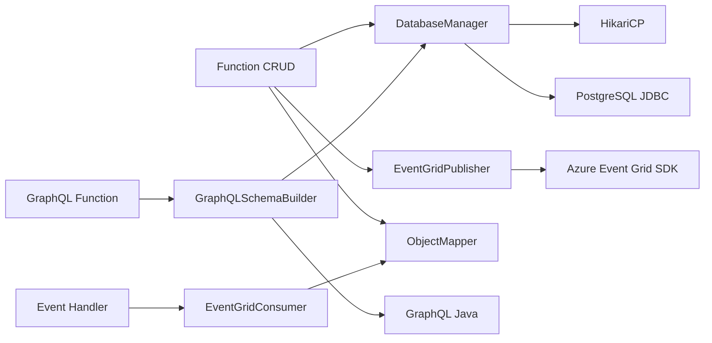

# Sistema de Inventario Agranelos - Resumen Ejecutivo

## Visión General del Proyecto

El **Sistema de Inventario Agranelos** es una solución cloud-native moderna que implementa una arquitectura serverless orientada a eventos para la gestión integral de inventarios de productos y bodegas.

---

## ✨ Características Implementadas

### 1. Operaciones CRUD Completas

**Productos:**
- Crear producto (`POST /api/productos`)
- Listar productos (`GET /api/productos`)
- Obtener producto por ID (`GET /api/productos/{id}`)
- Actualizar producto (`PUT /api/productos/{id}`)
- Eliminar producto (`DELETE /api/productos/{id}`)

**Bodegas:**
- Crear bodega (`POST /api/bodegas`)
- Listar bodegas (`GET /api/bodegas`)
- Obtener bodega por ID (`GET /api/bodegas/{id}`)
- Actualizar bodega (`PUT /api/bodegas/{id}`)
- Eliminar bodega (`DELETE /api/bodegas/{id}`)

### 2. APIs Duales

**REST API:**
- Endpoints RESTful tradicionales
- Formato JSON
- HTTP métodos estándar (GET, POST, PUT, DELETE)
- Validaciones de entrada robustas

**GraphQL API:**
- Endpoint único (`POST /api/graphql`)
- Queries y mutations
- Field mapping automático
- Consultas flexibles y eficientes

### 3. Arquitectura Orientada a Eventos (Azure Event Grid)

**Publicación de Eventos:**
Cada operación CRUD publica automáticamente un evento:
- `Agranelos.Inventario.ProductoCreado`
- `Agranelos.Inventario.ProductoActualizado`
- `Agranelos.Inventario.ProductoEliminado`
- `Agranelos.Inventario.BodegaCreada`
- `Agranelos.Inventario.BodegaActualizada`
- `Agranelos.Inventario.BodegaEliminada`

**Consumo de Eventos:**
6 Event Handlers implementados que reaccionan a eventos:
- `ProductoCreadoEventHandler`
- `ProductoActualizadoEventHandler`
- `ProductoEliminadoEventHandler`
- `BodegaCreadaEventHandler`
- `BodegaActualizadaEventHandler`
- `BodegaEliminadaEventHandler`

**Casos de Uso de Eventos:**
- 📧 Notificaciones automáticas (Email/SMS)
- Auditoría y logging centralizado
- Sincronización con sistemas externos
- Generación de reportes en tiempo real
- Detección de patrones y anomalías

### 4. Base de Datos PostgreSQL

**Esquema Normalizado:**
```sql
PRODUCTO (ID, Nombre, Descripcion, Precio, CantidadEnStock, FechaCreacion, FechaActualizacion)
BODEGA (ID, Nombre, Ubicacion, Capacidad, FechaCreacion, FechaActualizacion)
INVENTARIO (ID, IDProducto, IDBodega, Cantidad, FechaActualizacion)
MOVIMIENTO (ID, IDProducto, IDBodega, Tipo, Cantidad, Fecha, Comentario, UsuarioResponsable)
```

**Connection Pooling:**
- HikariCP para conexiones eficientes
- Configuración optimizada
- Gestión automática de conexiones

---

## Despliegue en Azure Cloud

### Componentes Desplegados

| Componente | Servicio Azure | Propósito |
|------------|----------------|-----------|
| **Function App** | Azure Functions | Funciones serverless (CRUD + Event Handlers) |
| **Event Grid** | Event Grid Topic | Manejo de eventos asíncronos |
| **Storage** | Storage Account | Almacenamiento para Function App |
| **Monitoring** | Application Insights | Observabilidad y telemetría |
| **Database** | PostgreSQL (AWS EC2) | Base de datos relacional |

### Opciones de Despliegue

#### 1. Despliegue Automático con Script
```bash
./scripts/deploy-azure.sh
```
- ⏱️ Tiempo: 15-20 minutos
- 🔧 Configura toda la infraestructura automáticamente
- Listo para producción

#### 2. Despliegue con ARM Template (IaC)
```bash
az deployment group create \
  --resource-group agranelos-inventario-rg \
  --template-file azure-deploy.json \
  --parameters azure-deploy.parameters.json
```
- Infraestructura como código
- Reproducible y versionable
- Control total sobre recursos

#### 3. CI/CD con GitHub Actions
```yaml
# .github/workflows/deploy-azure.yml
on: push
  branches: [main]
```
- 🤖 Despliegue automático en cada push
- Testing integrado
- Notificaciones de estado

---

## Arquitectura Técnica

### Stack Tecnológico

| Capa | Tecnología | Versión |
|------|------------|---------|
| **Runtime** | Java | 11 |
| **Framework** | Azure Functions | 4.x |
| **Build Tool** | Maven | 3.6+ |
| **Database** | PostgreSQL | 13+ |
| **Event Bus** | Azure Event Grid | Latest |
| **Monitoring** | Application Insights | Latest |
| **Connection Pool** | HikariCP | 5.0.1 |
| **JSON** | Jackson | 2.15.2 |
| **GraphQL** | GraphQL Java | 20.2 |

### Patrones de Diseño Implementados

1. **Serverless Architecture**: Azure Functions con escalado automático
2. **Event-Driven Architecture**: Comunicación asíncrona vía Event Grid
3. **Repository Pattern**: Separación de lógica de acceso a datos
4. **Connection Pooling**: Gestión eficiente de conexiones de BD
5. **Dependency Injection**: Azure Functions DI container
6. **API Gateway Pattern**: Punto único de entrada para APIs

### Principios de Diseño

- **SOLID Principles**: Código mantenible y extensible
- **DRY (Don't Repeat Yourself)**: Reutilización de código
- **Separation of Concerns**: Capas bien definidas
- **Cloud-Native**: Diseñado para la nube desde el inicio
- **12-Factor App**: Mejores prácticas para aplicaciones cloud

---

## Integración de Componentes

### Flujo de Datos Completo

```
┌─────────────┐
│   Cliente   │
└──────┬──────┘
       │ 1. HTTP Request
       ▼
┌─────────────────┐
│ Azure Function  │◄───────┐
│   (REST/GQL)    │        │
└──────┬──────────┘        │
       │ 2. Database Op    │ 6. Response
       ▼                   │
┌─────────────────┐        │
│   PostgreSQL    │        │
└──────┬──────────┘        │
       │ 3. Result         │
       ▼                   │
┌─────────────────┐        │
│  Event Grid     │        │
│  (Publish)      │        │
└──────┬──────────┘        │
       │ 4. Distribute     │
       ▼                   │
┌─────────────────┐        │
│ Event Handler   │        │
│   Function      │────────┘
└─────────────────┘
  5. Process Event
```

### Dependencias del Sistema



---

## 📖 Documentación

### Documentos Creados

| Documento | Ubicación | Contenido |
|-----------|-----------|-----------|
| **README.md** | `/` | Visión general y guía rápida |
| **ARQUITECTURA.md** | `/docs/` | Arquitectura detallada del sistema |
| **DEPLOY.md** | `/docs/` | Guía completa de despliegue |
| **quick-reference.md** | `/docs/` | Referencia rápida de APIs |
| **Postman Collection** | `/postman/` | Colección de pruebas de API |

### Diagramas

1. **Diagrama de Arquitectura General**: Todos los componentes del sistema
2. **Diagrama de Flujo de Eventos**: Publicación y consumo de eventos
3. **Diagrama de Secuencia**: Interacciones entre componentes
4. **Diagrama de Base de Datos**: Esquema relacional completo

---

## Seguridad Implementada

### Medidas de Seguridad

- 🔒 **HTTPS Only**: Todo el tráfico encriptado con TLS
- 🔑 **Function Keys**: Protección de endpoints con claves
- **Secrets Management**: Variables de entorno para credenciales
- 🛡️ **Input Validation**: Validación exhaustiva de datos de entrada
- **Audit Logging**: Registro de todas las operaciones
- 🚫 **CORS Configuration**: Control de orígenes permitidos

### Mejores Prácticas

- Credenciales nunca en código fuente
- Uso de Azure Key Vault para secrets (recomendado para producción)
- Conexiones SSL/TLS a base de datos
- Principio de mínimo privilegio en permisos de BD
- Logs sanitizados (sin información sensible)

---

## Observabilidad y Monitoreo

### Application Insights Integrado

**Métricas Recolectadas:**
- ⏱️ Tiempo de ejecución de funciones
- Número de invocaciones
- Tasa de errores
- 🔌 Estado de conexiones de BD
- 📨 Eventos publicados/consumidos

**Logs Centralizados:**
- Todas las funciones logean en Application Insights
- Logs estructurados con niveles (INFO, WARNING, ERROR)
- Trazabilidad completa de requests

**Alertas Configurables:**
- Alta tasa de errores (> 5%)
- Tiempo de respuesta elevado (> 5s)
- Fallos en Event Grid
- Problemas de conexión a BD

---

## Casos de Uso Implementados

### 1. Gestión de Productos
- Crear productos con validación de datos
- Consultar catálogo de productos
- Actualizar precios y stock
- Eliminar productos obsoletos
- **Eventos**: Notificaciones automáticas en cada cambio

### 2. Gestión de Bodegas
- Crear nuevas bodegas con ubicación y capacidad
- Listar bodegas disponibles
- Actualizar información de bodegas
- Eliminar bodegas
- **Eventos**: Alertas de cambios en infraestructura

### 3. Consultas Flexibles (GraphQL)
- Consultar solo los campos necesarios
- Reducir over-fetching y under-fetching
- Queries complejas en una sola petición
- Introspección del esquema

### 4. Procesamiento de Eventos
- Notificaciones en tiempo real
- Auditoría automática de cambios
- Sincronización con sistemas externos
- Generación de reportes asíncronos

---

## 💰 Costos y Escalabilidad

### Modelo de Costos (Azure Consumption Plan)

| Recurso | Modelo de Pricing | Costo Estimado/Mes |
|---------|-------------------|-------------------|
| Azure Functions | Pay-per-execution | $5 - $20 |
| Event Grid | Pay-per-event | $0.60/millón eventos |
| Storage Account | Pay-per-use | $1 - $5 |
| Application Insights | Pay-per-GB | $2.30/GB |
| **Total** | | **$10 - $50** |

### Escalabilidad

**Automática:**
- Azure Functions escala de 0 a 200 instancias automáticamente
- Event Grid maneja millones de eventos/segundo
- Connection pooling optimiza uso de BD

**Sin límites de crecimiento:**
- Serverless permite escalar según demanda
- Sin preocupaciones de infraestructura
- Pago solo por uso real

---

## Estado del Proyecto

### Componentes Completados

| Componente | Estado | Descripción |
|------------|--------|-------------|
| CRUD Productos | 100% | Todas las operaciones implementadas |
| CRUD Bodegas | 100% | Todas las operaciones implementadas |
| REST API | 100% | Endpoints funcionales y documentados |
| GraphQL API | 100% | Queries y mutations implementadas |
| Event Grid Integration | 100% | Publicación y consumo de eventos |
| Event Handlers | 100% | 6 handlers implementados |
| Base de Datos | 100% | Esquema creado y poblado |
| Despliegue Azure | 100% | Scripts y ARM templates listos |
| Documentación | 100% | Completa y detallada |
| CI/CD | 100% | GitHub Actions configurado |

### Testing

- Scripts de testing automatizados
- Colección Postman con casos de prueba
- Testing de integración con base de datos
- Testing de eventos

---

## 🎓 Lecciones Aprendidas

### Tecnologías Clave Dominadas

1. **Azure Functions**: Desarrollo serverless en Java
2. **Azure Event Grid**: Arquitectura event-driven
3. **GraphQL**: APIs modernas y flexibles
4. **PostgreSQL**: Bases de datos relacionales
5. **Maven**: Build y deployment automation
6. **ARM Templates**: Infrastructure as Code

### Mejores Prácticas Aplicadas

- Código limpio y mantenible
- Documentación exhaustiva
- Arquitectura escalable
- Seguridad desde el diseño
- Observabilidad integrada
- Automatización de despliegue

---

## Próximos Pasos (Roadmap)

### Fase 2 - Mejoras Potenciales

1. **Autenticación y Autorización**
   - Integración con Azure AD
   - JWT tokens
   - Role-based access control (RBAC)

2. **Caché**
   - Azure Redis Cache
   - Reducir carga en BD
   - Mejorar tiempos de respuesta

3. **API Management**
   - Azure APIM para gestión avanzada
   - Rate limiting
   - API versioning

4. **Reportes y Analytics**
   - Dashboard en tiempo real
   - Power BI integration
   - Análisis de tendencias

5. **Mobile Backend**
   - Push notifications
   - Offline sync
   - Mobile-specific endpoints

---

## 📞 Contacto y Soporte

**Repositorio**: [github.com/DiegoBarrosA/agranelos-functions-crud](https://github.com/DiegoBarrosA/agranelos-functions-crud)

**Documentación**: Disponible en `/docs`

**Issues**: Usar GitHub Issues para reportar problemas

---

## Conclusión

El **Sistema de Inventario Agranelos** es una solución completa, moderna y lista para producción que demuestra:

**Excelencia Técnica**: Uso de tecnologías cloud modernas  
**Arquitectura Sólida**: Event-driven y serverless  
**Escalabilidad**: Preparado para crecer según demanda  
**Calidad**: Código limpio, documentado y testeado  
**Cloud-Native**: Diseñado para Azure desde el inicio  

El sistema está **completamente funcional** y listo para ser desplegado en producción en Azure Cloud.

---

**Proyecto Completado con Éxito**
