# 📚 Documentación API - Sistema Inventario Agranelos

> Sistema completo de gestión de inventario con APIs duales (REST y GraphQL)

## 🎯 Visión General

El Sistema de Inventario Agranelos proporciona APIs modernas para la gestión completa de productos y bodegas, implementado con tecnología cloud-native en Azure Functions.

### 🌟 Características Principales

- **🔗 API REST**: Endpoints tradicionales para operaciones CRUD
- **🚀 API GraphQL**: Consultas flexibles y eficientes
- **⚡ Field Mapping**: Mapeo automático de campos
- **☁️ Cloud Native**: Desplegado en Azure Functions
- **🧪 Testing Completo**: Scripts y Postman collection

### 📡 URLs Base

```
REST API:    https://agranelos-fybpb6duaadaaxfm.eastus2-01.azurewebsites.net/api
GraphQL API: https://agranelos-fybpb6duaadaaxfm.eastus2-01.azurewebsites.net/api/graphql
```

### 🔧 Testing Tools

- **📋 Scripts Automatizados**: [`scripts/testing/`](https://github.com/DiegoBarrosA/agranelos-functions-crud/tree/main/scripts/testing)
- **📦 Postman Collection**: [`postman/`](https://github.com/DiegoBarrosA/agranelos-functions-crud/tree/main/postman)

---

## 🎨 Arquitectura del Sistema

```mermaid
graph TB
    %% Frontend Layer
    subgraph "�️ Frontend Layer"
        WEB[Web Client]
        MOB[Mobile App]
        DESK[Desktop App]
    end
    
    %% BFF Layer (Repositorio Separado)
    subgraph "🌉 BFF Layer (Backend for Frontend)"
        BFF[BFF Service<br/>Repository Separado]
        CACHE[Cache Layer]
        AUTH[Authentication]
    end
    
    %% API Layer (Este Repositorio)
    subgraph "🔌 API Layer - Este Repositorio"
        subgraph "☁️ Azure Functions"
            REST[REST API<br/>CRUD Operations]
            GRAPHQL[GraphQL API<br/>Flexible Queries]
        end
        
        subgraph "📊 Data Processing"
            MAPPER[Field Mapping<br/>cantidad ↔ cantidadEnStock]
            VALIDATOR[Data Validation]
            TRANSFORMER[Data Transformation]
        end
    end
    
    %% Infrastructure Layer
    subgraph "🏗️ Infrastructure Layer"
        subgraph "☁️ AWS EC2"
            DOCKER[🐳 Docker PostgreSQL]
            BACKUP[Backup Service]
        end
        
        AZURE[☁️ Azure Functions<br/>Hosting]
    end
    
    %% Development & Testing
    subgraph "🧪 Development & Testing"
        SCRIPTS[📋 Test Scripts<br/>scripts/testing/]
        POSTMAN[📦 Postman Collection<br/>postman/]
        DOCS[📚 Documentation<br/>docs/]
    end
    
    %% Connections
    WEB --> BFF
    MOB --> BFF
    DESK --> BFF
    
    BFF --> REST
    BFF --> GRAPHQL
    BFF <--> CACHE
    BFF <--> AUTH
    
    REST --> MAPPER
    GRAPHQL --> MAPPER
    
    MAPPER --> VALIDATOR
    VALIDATOR --> TRANSFORMER
    TRANSFORMER --> DOCKER
    
    AZURE -.->|"Host"| REST
    AZURE -.->|"Host"| GRAPHQL
    
    SCRIPTS -.->|"Test"| REST
    SCRIPTS -.->|"Test"| GRAPHQL
    POSTMAN -.->|"Test"| REST
    POSTMAN -.->|"Test"| GRAPHQL
    
    DOCKER --> BACKUP
    
    style BFF fill:#e1f5fe
    style REST fill:#fff3e0
    style GRAPHQL fill:#f3e5f5
    style DOCKER fill:#e8f5e8
    style SCRIPTS fill:#fff8e1
    style POSTMAN fill:#fce4ec
```



---

## 🔍 QUERIES GraphQL (Consultas)

### 1. Obtener todos los productos
```bash
curl -X POST https://agranelos-fybpb6duaadaaxfm.eastus2-01.azurewebsites.net/api/graphql \
     -H "Content-Type: application/json" \
     -d '{
   "query": "query { productos { id nombre descripcion precio cantidad fechaCreacion fechaActualizacion } }"
 }'
```

**Respuesta esperada:**
```json
{
  "data": {
    "productos": [
      {
        "id": "1",
        "nombre": "Producto Ejemplo",
        "descripcion": "Descripción del producto",
        "precio": 29.99,
        "cantidad": 100,
        "fechaCreacion": "2025-09-14T10:30:00",
        "fechaActualizacion": "2025-09-14T15:45:00"
      }
    ]
  }
}
```

### 2. Obtener producto por ID
```bash
curl -X POST https://agranelos-fybpb6duaadaaxfm.eastus2-01.azurewebsites.net/api/graphql \
     -H "Content-Type: application/json" \
     -d '{
   "query": "query($id: ID!) { producto(id: $id) { id nombre descripcion precio cantidad fechaCreacion fechaActualizacion } }",
   "variables": { "id": "1" }
 }'
```

### 3. Obtener todas las bodegas
```bash
curl -X POST https://agranelos-fybpb6duaadaaxfm.eastus2-01.azurewebsites.net/api/graphql \
     -H "Content-Type: application/json" \
     -d '{
   "query": "query { bodegas { id nombre ubicacion capacidad fechaCreacion fechaActualizacion } }"
 }'
```

### 4. Obtener bodega por ID
```bash
curl -X POST https://agranelos-fybpb6duaadaaxfm.eastus2-01.azurewebsites.net/api/graphql \
     -H "Content-Type: application/json" \
     -d '{
   "query": "query($id: ID!) { bodega(id: $id) { id nombre ubicacion capacidad fechaCreacion fechaActualizacion } }",
   "variables": { "id": "1" }
 }'
```

### 5. Health Check
```bash
curl -X POST https://agranelos-fybpb6duaadaaxfm.eastus2-01.azurewebsites.net/api/graphql \
     -H "Content-Type: application/json" \
     -d '{
   "query": "query { health }"
 }'
```

---

## ✏️ MUTATIONS (Operaciones de escritura)

### 1. Crear producto
```bash
curl -X POST https://agranelos-fybpb6duaadaaxfm.eastus2-01.azurewebsites.net/api/graphql \
     -H "Content-Type: application/json" \
     -d '{
   "query": "mutation($input: ProductoInput!) { crearProducto(input: $input) { success message error producto { id nombre precio cantidad } } }",
   "variables": {
     "input": {
       "nombre": "Nuevo Producto",
       "descripcion": "Descripción del nuevo producto",
       "precio": 45.50,
       "cantidad": 200
     }
   }
 }'
```

### 2. Actualizar producto
```bash
curl -X POST https://agranelos-fybpb6duaadaaxfm.eastus2-01.azurewebsites.net/api/graphql \
     -H "Content-Type: application/json" \
     -d '{
   "query": "mutation($input: ProductoUpdateInput!) { actualizarProducto(input: $input) { success message error producto { id nombre precio cantidad } } }",
   "variables": {
     "input": {
       "id": "1",
       "nombre": "Producto Actualizado",
       "descripcion": "Nueva descripción",
       "precio": 55.99,
       "cantidad": 150
     }
   }
 }'
```

### 3. Eliminar producto
```bash
curl -X POST https://agranelos-fybpb6duaadaaxfm.eastus2-01.azurewebsites.net/api/graphql \
     -H "Content-Type: application/json" \
     -d '{
   "query": "mutation($id: ID!) { eliminarProducto(id: $id) { success message error } }",
   "variables": { "id": "1" }
 }'
```

### 4. Crear bodega
```bash
curl -X POST https://agranelos-fybpb6duaadaaxfm.eastus2-01.azurewebsites.net/api/graphql \
     -H "Content-Type: application/json" \
     -d '{
   "query": "mutation($input: BodegaInput!) { crearBodega(input: $input) { success message error bodega { id nombre ubicacion capacidad } } }",
   "variables": {
     "input": {
       "nombre": "Bodega Principal",
       "ubicacion": "Zona Industrial Norte",
       "capacidad": 5000
     }
   }
 }'
```

### 5. Actualizar bodega
```bash
curl -X POST https://agranelos-fybpb6duaadaaxfm.eastus2-01.azurewebsites.net/api/graphql \
     -H "Content-Type: application/json" \
     -d '{
   "query": "mutation($input: BodegaUpdateInput!) { actualizarBodega(input: $input) { success message error bodega { id nombre ubicacion capacidad } } }",
   "variables": {
     "input": {
       "id": "1",
       "nombre": "Bodega Central Actualizada",
       "ubicacion": "Nueva Zona Industrial",
       "capacidad": 8000
     }
   }
 }'
```

### 6. Eliminar bodega
```bash
curl -X POST https://agranelos-fybpb6duaadaaxfm.eastus2-01.azurewebsites.net/api/graphql \
     -H "Content-Type: application/json" \
     -d '{
   "query": "mutation($id: ID!) { eliminarBodega(id: $id) { success message error } }",
   "variables": { "id": "1" }
 }'
```

### 7. Inicializar base de datos
```bash
curl -X POST https://agranelos-fybpb6duaadaaxfm.eastus2-01.azurewebsites.net/api/graphql \
     -H "Content-Type: application/json" \
     -d '{
   "query": "mutation { inicializarBaseDatos }"
 }'
```

---

## 📋 ESQUEMA DE DATOS

### Tipo Producto
```graphql
type Producto {
    id: ID!
    nombre: String!
    descripcion: String
    precio: Float!
    cantidad: Int!
    fechaCreacion: DateTime
    fechaActualizacion: DateTime
}
```

### Tipo Bodega
```graphql
type Bodega {
    id: ID!
    nombre: String!
    ubicacion: String!
    capacidad: Int!
    fechaCreacion: DateTime
    fechaActualizacion: DateTime
}
```

### Inputs para Mutations

#### ProductoInput
```graphql
input ProductoInput {
    nombre: String!
    descripcion: String
    precio: Float!
    cantidad: Int!
}
```

#### ProductoUpdateInput
```graphql
input ProductoUpdateInput {
    id: ID!
    nombre: String
    descripcion: String
    precio: Float
    cantidad: Int
}
```

#### BodegaInput
```graphql
input BodegaInput {
    nombre: String!
    ubicacion: String!
    capacidad: Int
}
```

#### BodegaUpdateInput
```graphql
input BodegaUpdateInput {
    id: ID!
    nombre: String
    ubicacion: String
    capacidad: Int
}
```

---

## 🎯 EJEMPLOS DE CONSULTAS COMPLEJAS

### Consulta múltiple (productos y bodegas)
```bash
curl -X POST https://agranelos-fybpb6duaadaaxfm.eastus2-01.azurewebsites.net/api/graphql \
     -H "Content-Type: application/json" \
     -d '{
   "query": "query { productos { id nombre precio cantidad } bodegas { id nombre ubicacion capacidad } }"
 }'
```

### Consulta con campos específicos
```bash
curl -X POST https://agranelos-fybpb6duaadaaxfm.eastus2-01.azurewebsites.net/api/graphql \
     -H "Content-Type: application/json" \
     -d '{
   "query": "query { productos { id nombre precio } }"
 }'
```

### Operación con nombre y variables
```bash
curl -X POST https://agranelos-fybpb6duaadaaxfm.eastus2-01.azurewebsites.net/api/graphql \
     -H "Content-Type: application/json" \
     -d '{
   "query": "query GetProductoDetalle($productId: ID!) { producto(id: $productId) { id nombre descripcion precio cantidad fechaCreacion } }",
   "variables": { "productId": "1" },
   "operationName": "GetProductoDetalle"
 }'
```

---

## ⚠️ MANEJO DE ERRORES

### Error de validación
```json
{
  "errors": [
    {
      "message": "Validation error (FieldUndefined@[productos/campoInexistente]) : Field 'campoInexistente' in type 'Producto' is undefined",
      "locations": [{"line": 1, "column": 20}],
      "extensions": {"classification": "ValidationError"}
    }
  ]
}
```

### Error de servidor
```json
{
  "errors": [
    {
      "message": "Error interno del servidor"
    }
  ]
}
```

### Respuesta de mutation con error
```json
{
  "data": {
    "crearProducto": {
      "success": false,
      "message": "",
      "error": "El nombre del producto es requerido",
      "producto": null
    }
  }
}
```

---

## 🔗 COMPARACIÓN CON REST API

| GraphQL Endpoint | REST Equivalente |
|------------------|------------------|
| `query { productos }` | `GET /api/productos` |
| `query { producto(id: "1") }` | `GET /api/productos/1` |
| `mutation { crearProducto(...) }` | `POST /api/productos` |
| `mutation { actualizarProducto(...) }` | `PUT /api/productos/1` |
| `mutation { eliminarProducto(...) }` | `DELETE /api/productos/1` |
| `query { bodegas }` | `GET /api/bodegas` |
| `query { bodega(id: "1") }` | `GET /api/bodegas/1` |

---

## 📝 NOTAS TÉCNICAS

1. **Campo `cantidad`**: En el esquema GraphQL se llama `cantidad`, pero internamente mapea al campo Java `cantidadEnStock`
2. **Fechas**: Se manejan como scalar `DateTime` en formato ISO 8601
3. **IDs**: Se manejan como strings en GraphQL pero son integers en la base de datos
4. **Validaciones**: Los campos marcados con `!` son obligatorios
5. **Capacidad por defecto**: Las bodegas sin capacidad especificada usan 1000 como valor por defecto

---

## 🚀 Enlaces Rápidos

- **🔧 Testing Scripts**: [scripts/testing/](https://github.com/DiegoBarrosA/agranelos-functions-crud/tree/main/scripts/testing) - Scripts automatizados para probar todas las APIs
- **📦 Postman Collection**: [postman/](https://github.com/DiegoBarrosA/agranelos-functions-crud/tree/main/postman) - Colección completa para testing manual
- **📊 REST API**: Endpoints tradicionales para operaciones CRUD
- **🎯 GraphQL API**: Consultas flexibles y eficientes

### 📋 Quick Commands

```bash
# Ejecutar todos los tests
./scripts/testing/test-all-apis.sh

# Test GraphQL solamente
./scripts/testing/test-graphql-api.sh

# Test REST solamente
./scripts/testing/test-rest-api.sh

# Test de rendimiento
./scripts/testing/test-performance.sh

# Importar Postman collection
# Archivo: postman/Agranelos-Inventario-API-Collection.postman_collection.json
```

---

<div align="center">
  <i>📚 Documentación completa del Sistema de Inventario Agranelos</i><br>
  <small>Última actualización: 2025</small>
</div>