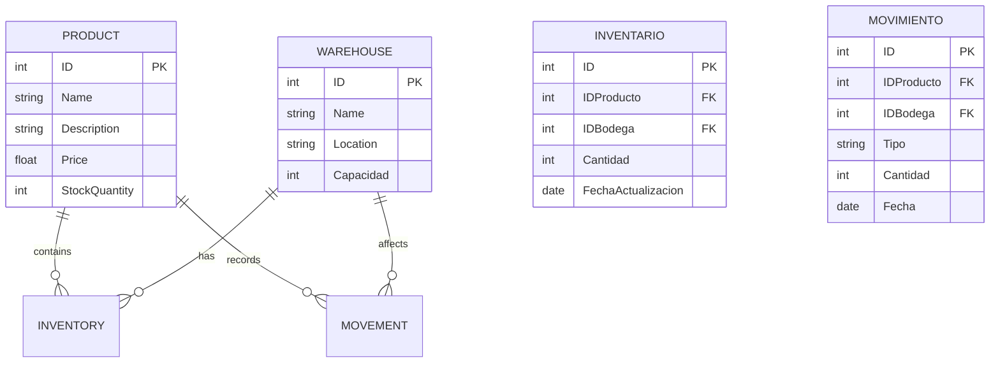

## System Architecture

The inventory system architecture is designed to be modular, scalable, and efficient, leveraging modern cloud service development and deployment technologies. Here is a detailed description of the components and how they interact:

1. **Frontend (Not Applicable):**
    - Although a frontend component usually exists for end-user interaction, in this specific case it is not required. Interactions with the system are performed via direct API calls exposed by the backend.
2. **Backend:**
    - **BFF Microservice (Backend For Frontend):**
        - This microservice acts as an intermediary handling incoming requests.
        - Its main responsibility is to orchestrate calls to the appropriate serverless functions based on the received request.
        - Exposes RESTful APIs that allow clients to perform operations on products and warehouses. These APIs return data in JSON format for easy consumption.
3. **Serverless Functions:**
    - These functions are implemented in Java and are responsible for executing specific business operations.
    - **Key Functions:**
        - Perform CRUD operations (Create, Read, Update, Delete) on products and warehouses.
        - Manage logic for handling inventory changes, such as registering product entries and exits in warehouses.
4. **Database:**
    - Contains all relevant system information, including product data, warehouses, current inventory, and historical movement records.
    - Serverless functions interact directly with this database for read and write operations.
5. **Communication and Data Flow:**
    - Client requests (or direct calls) are received by the BFF Microservice.
    - The BFF processes requests and determines which serverless functions should be invoked to fulfill the request.
    - Serverless functions perform the necessary operations on the database and return results to the BFF.
    - The BFF responds to the client with processed and formatted JSON results.
6. **Technologies Used:**
    - **Docker:** Used for development and testing, allowing local emulation of a production environment and facilitating dependency and configuration management.
    - **Git and Collaborative Tools:** For source code management and effective team collaboration, ensuring organized development and version control.
    - **Java and Spring Boot:** Main technologies for implementing microservices and serverless functions, leveraging their robust capabilities for enterprise application development.

This architecture leverages the serverless nature for functions that interact with the database, enabling automatic scalability and efficient resource management according to demand, ensuring optimal performance and high system availability.


## Database



## Funciones Implementadas

A continuación se detallan los endpoints de la API para la gestión de productos.

### Productos

| Verbo  | Ruta                  | Descripción                        |
| :----- | :-------------------- | :--------------------------------- |
| `GET`  | `/api/productos`      | Obtiene la lista de todos los productos. |
| `GET`  | `/api/productos/{id}` | Obtiene un producto específico por su ID. |
| `POST` | `/api/productos`      | Crea un nuevo producto.            |
| `PUT`  | `/api/productos/{id}` | Actualiza un producto existente por su ID. |
| `DELETE`| `/api/productos/{id}`| Elimina un producto por su ID.     |

## Compilación, Pruebas y Despliegue del Proyecto

Para probar y realizar despliegues del proyecto de Azure Functions con Java y Maven, sigue estos pasos:

---

## Configuración de secretos y variables de entorno

### 1. Subir secretos a GitHub Actions

Los secretos permiten almacenar información sensible (como contraseñas, claves API, etc.) de forma segura para usarlas en tus workflows de GitHub Actions.

**Pasos:**
1. Ve a tu repositorio en GitHub.
2. Haz clic en **Settings**.
3. En el menú lateral, selecciona **Secrets and variables > Actions**.
4. Haz clic en **New repository secret**.
5. Escribe el nombre del secreto (por ejemplo: `DB_PASSWORD`) y su valor.
6. Haz clic en **Add secret**.

Repite para cada secreto necesario (`DB_HOST`, `DB_USER`, `DB_PASSWORD`, etc.).

---

### 2. Subir variables de entorno a Azure Function App

Las Azure Function Apps usan “Application settings” para definir variables de entorno en producción.

**Pasos:**
1. Ve al portal de Azure: https://portal.azure.com/
2. Busca y selecciona tu **Function App**.
3. En el menú izquierdo, haz clic en **Configuration**.
4. En la pestaña **Application settings**, haz clic en **New application setting**.
5. Escribe el nombre (por ejemplo: `DB_PASSWORD`) y el valor.
6. Haz clic en **OK** y luego en **Save** (parte superior).
7. Reinicia la Function App si es necesario.

Repite para cada variable que necesites.

---

### 3. Template para `local.settings.json` (sin valores)

Este archivo es solo para desarrollo local y **no debe subirse a GitHub**. Sirve para definir variables de entorno cuando ejecutas las funciones localmente.

```json
{
  "IsEncrypted": false,
  "Values": {
    "AzureWebJobsStorage": "",
    "FUNCTIONS_WORKER_RUNTIME": "java",
    "DB_HOST": "",
    "DB_PORT": "",
    "DB_NAME": "",
    "DB_USER": "",
    "DB_PASSWORD": "",
    "DB_SSL_MODE": ""
  }
}
```

---

### 4. Conectar GitHub con Azure (Deployment Center)

Puedes automatizar el despliegue desde GitHub a Azure Functions usando el Deployment Center del portal de Azure:

1. Ve a tu **Function App** en el portal de Azure.
2. En el menú izquierdo, haz clic en **Deployment Center**.
3. Selecciona **GitHub** como fuente.
4. Autentica con tu cuenta de GitHub si es necesario.
5. Selecciona el repositorio y la rama que deseas conectar.
6. Completa el asistente y guarda la configuración.

A partir de ahora, cada vez que hagas push a la rama seleccionada, Azure desplegará automáticamente tu aplicación.

---

1. **Construcción y Pruebas Locales:**

    - Asegúrate de estar en el directorio del proyecto y de haber ingresado al entorno de desarrollo configurado con Nix:

        `nix develop`

    - Compila y ejecuta las pruebas del proyecto usando Maven:

        `mvn clean install`

    - Para probar las funciones localmente, puedes utilizar el siguiente comando:

        `mvn azure-functions:run`
        
    1.    - Alternativamente, puedes usar Azure Functions Core Tools desde el directorio raíz del proyecto:
    
        1. Asegúrate de tener instaladas las [Azure Functions Core Tools](https://learn.microsoft.com/azure/azure-functions/functions-run-local).
        2.    Navega al directorio de la aplicación de funciones dentro del repositorio:

                ```bash
                cd agranelos-functions-crud-create/inventario-functions-create
                ```
        3.    Inicia el host de funciones desde el subdirectorio de las funciones:
        
            ```bash
            func start
            ```
        4. Las funciones estarán disponibles en <http://localhost:7071>.


    Esto iniciará un servidor local de Azure Functions, permitiéndote invocar y probar tus funciones directamente desde tu entorno de desarrollo.

2. **Despliegue a Azure:**

    - Primero, asegúrate de estar autenticado en Azure CLI. Si no lo has hecho, ejecuta:

        `az login`

    - Despliega tu aplicación usando Maven. Esto empaquetará y desplegará tus funciones a Azure:

        `mvn azure-functions\:deploy`


    Asegúrate de tener configurado correctamente el archivo de configuración de Azure Functions y de que todos los recursos necesarios (como una cuenta de almacenamiento y una aplicación de funciones) estén disponibles en tu suscripción de Azure.

3. **Monitoreo y Verificación:**

    - Una vez desplegadas, puedes monitorear el estado de tus funciones a través del portal de Azure o mediante la CLI de Azure para verificar que estén operando correctamente.
    - Realiza pruebas de integración llamando a los endpoints de tus funciones desplegadas para asegurarte de que todo funciona como se espera en el entorno de producción.
