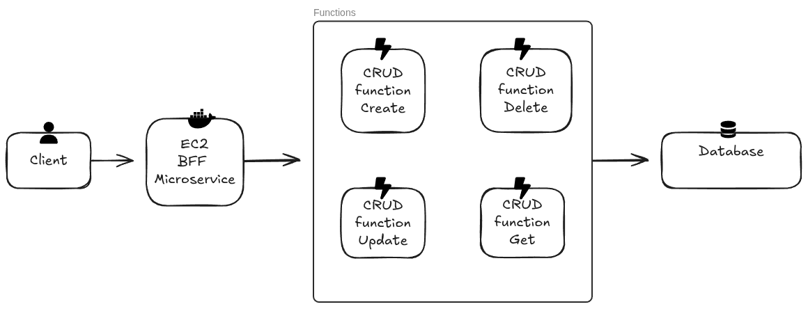
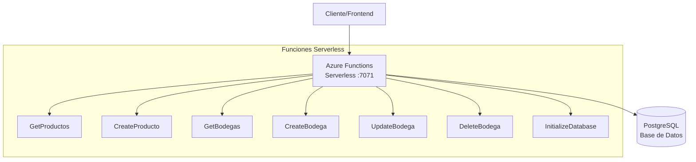
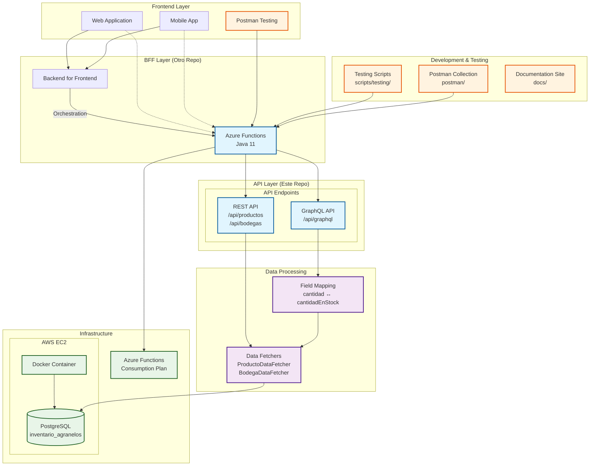
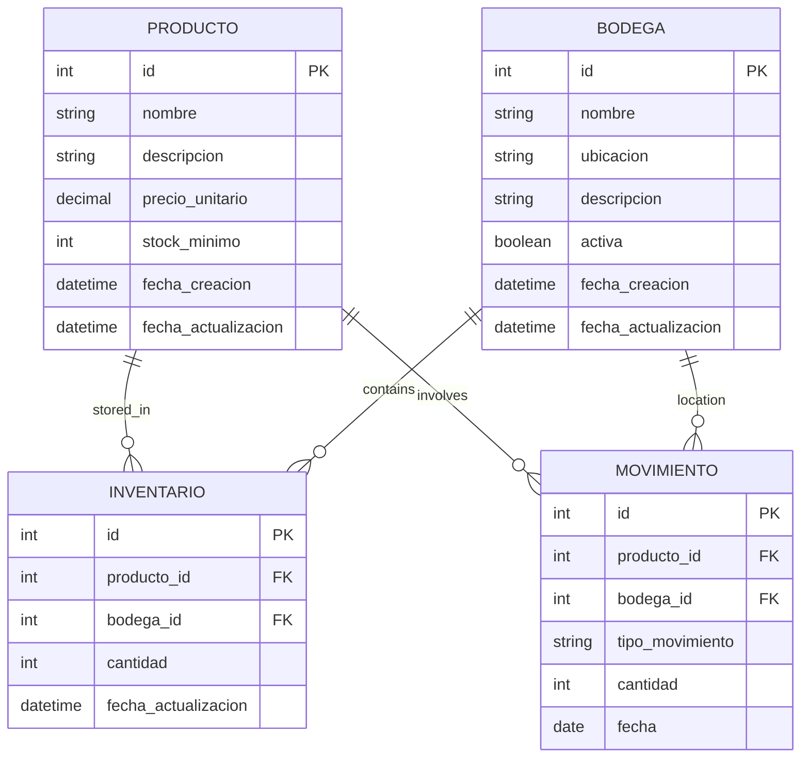

# 🏭 Sistema de Inventario Agranelos - Backend API

> Sistema completo de gestión de inventario con APIs REST y GraphQL, desarrollado con Azure Functions y Java 11.

Backend serverless para sistema de inventario de bodegas implementado con **Azure Functions** y PostgreSQL.



## 🎯 Descripción

Sistema backend para gestión de inventario que proporciona APIs duales (REST y GraphQL) para operaciones CRUD sobre productos y bodegas. Implementado como Azure Functions con base de datos PostgreSQL.

## Arquitectura del Sistema



### 🌟 Características Principales

- **📡 API Dual**: REST y GraphQL en la misma infraestructura
- **☁️ Cloud Native**: Desplegado en Azure Functions
- **🗃️ Base de Datos**: PostgreSQL con manejo de caso sensitivo
- **🔍 Field Mapping**: Mapeo automático de campos GraphQL-Java
- **🧪 Testing Completo**: Scripts automatizados y colección Postman
- **📖 Documentación**: Sitio de documentación con Jekyll/GitHub Pages

## 🏗️ Arquitectura del Sistema

El sistema implementa:

- **Funciones Serverless**: Azure Functions para operaciones CRUD directas sobre la base de datos
- **Base de Datos**: PostgreSQL con esquema normalizado para productos, bodegas, inventario y movimientos
- **CI/CD Automático**: GitHub Actions para despliegue automático a Azure Functions



## Modelo de Base de Datos



## Funciones Implementadas

El sistema expone los siguientes endpoints a través de las funciones serverless de Azure Functions:

### Azure Functions Serverless (Puerto 7071)

#### Productos

| Verbo  | Ruta                  | Descripción                        |
| :----- | :-------------------- | :--------------------------------- |
| `GET`  | `/api/productos`      | Obtiene la lista de todos los productos. |
| `GET`  | `/api/productos/{id}` | Obtiene un producto específico por su ID. |
| `POST` | `/api/productos`      | Crea un nuevo producto.            |
| `PUT`  | `/api/productos/{id}` | Actualiza un producto existente por su ID. |
| `DELETE`| `/api/productos/{id}`| Elimina un producto por su ID.     |

#### Bodegas

| Verbo  | Ruta                  | Descripción                        |
| :----- | :-------------------- | :--------------------------------- |
| `GET`  | `/api/bodegas`        | Obtiene la lista de todas las bodegas. |
| `GET`  | `/api/bodegas/{id}`   | Obtiene una bodega específica por su ID. |
| `POST` | `/api/bodegas`        | Crea una nueva bodega.             |
| `PUT`  | `/api/bodegas/{id}`   | Actualiza una bodega existente por su ID. |
| `DELETE`| `/api/bodegas/{id}`  | Elimina una bodega por su ID.      |

#### Utilidades

| Verbo  | Ruta          | Descripción                        | Seguridad |
| :----- | :------------ | :--------------------------------- | :-------- |
| `POST` | `/api/init`   | Inicializa la base de datos con esquemas y datos de prueba. | ⚠️ **Sólo desarrollo** - Requiere `ENABLE_INIT=true` y clave de función |

### 🔧 Componentes Técnicos

#### Backend API (Este Repositorio)
- **Azure Functions**: Runtime serverless Java 11
- **REST Endpoints**: `/api/productos`, `/api/bodegas`, `/api/initdb`
- **GraphQL Endpoint**: `/api/graphql` con schema completo
- **Field Mapping**: Sistema de mapeo automático de campos
- **Data Fetchers**: Capa de acceso a datos optimizada

#### Base de Datos
- **PostgreSQL 14**: Ejecutándose en Docker en AWS EC2
- **Schema**: Tablas `PRODUCTO` y `BODEGA` con campos case-sensitive
- **Manejo de Casos**: Nombres de columnas con quotes para compatibilidad

#### BFF (Backend for Frontend)
- **Ubicación**: Repositorio separado
- **Función**: Orquestación y agregación de datos
- **Clients**: Web y Mobile applications

### GraphQL API (Alternativa Moderna)

Además de los endpoints REST tradicionales, el sistema incluye soporte completo para **GraphQL** como alternativa moderna y flexible:

- **Manejo de Casos**: Nombres de columnas con quotes para compatibilidad

| Verbo  | Ruta          | Descripción                        |

#### BFF (Backend for Frontend)| :----- | :------------ | :--------------------------------- |

- **Ubicación**: Repositorio separado| `POST` | `/api/graphql`| Endpoint único GraphQL para todas las operaciones |

- **Función**: Orquestación y agregación de datos

- **Clients**: Web y Mobile applications#### Ejemplo de Queries GraphQL


## 🚀 Inicio Rápido**Query - Obtener todos los productos:**

```graphql

### Prerrequisitosquery {

  productos {

```bash    id

# Java 11 o superior    nombre

java -version    descripcion

    precio

# Maven 3.6+      cantidadEnStock

mvn -version    fechaCreacion

  }

# Azure Functions Core Tools (opcional para desarrollo local)}

func --version```

```

**Query - Obtener producto específico:**

### Instalación y Despliegue```graphql

query {

```bash  producto(id: "1") {

# Clonar repositorio    id

git clone https://github.com/DiegoBarrosA/agranelos-functions-crud.git    nombre

cd agranelos-functions-crud    descripcion

    precio

# Compilar proyecto    cantidadEnStock

mvn clean package  }

}

# Desplegar a Azure (configurar Azure CLI previamente)```

mvn azure-functions:deploy

```**Mutation - Crear nuevo producto:**

```graphql

### Configuraciónmutation {

  crearProducto(input: {

Configurar variables de entorno en `local.settings.json`:    nombre: "Producto GraphQL"

    descripcion: "Creado via GraphQL"

```json    precio: 29.99

{    cantidad: 100

  "IsEncrypted": false,  }) {

  "Values": {    success

    "FUNCTIONS_WORKER_RUNTIME": "java",    message

    "DB_HOST": "your-db-host",    producto {

    "DB_PORT": "5432",      id

    "DB_NAME": "inventario_agranelos",      nombre

    "DB_USER": "postgres",      precio

    "DB_PASSWORD": "your-password",    }

    "DB_SSL_MODE": "disable"    error

  }  }

}}

``````


## 📡 APIs Disponibles**Mutation - Crear nueva bodega:**

```graphql

### 🔗 REST APImutation {

  crearBodega(input: {

**Base URL**: `https://agranelos-fybpb6duaadaaxfm.eastus2-01.azurewebsites.net/api`    nombre: "Bodega GraphQL"

    ubicacion: "Santiago Norte"

#### Productos    capacidad: 5000

```http  }) {

GET    /productos           # Obtener todos los productos    success

GET    /productos/{id}      # Obtener producto por ID    message

POST   /productos           # Crear producto    bodega {

PUT    /productos/{id}      # Actualizar producto      id

DELETE /productos/{id}      # Eliminar producto      nombre

```      ubicacion

      capacidad

#### Bodegas    }

```http    error

GET    /bodegas             # Obtener todas las bodegas  }

GET    /bodegas/{id}        # Obtener bodega por ID}

| Verbo  | Ruta          | Descripción                        |
| :----- | :------------ | :--------------------------------- |
| `POST` | `/api/graphql`| Endpoint único GraphQL para todas las operaciones |

### 🚀 GraphQL API  

**Endpoint**: `${GRAPHQL_URL}`

#### Configuración de Variables de Entorno

Antes de ejecutar las consultas GraphQL, configura las variables de entorno:

```bash
# Desarrollo Local
export GRAPHQL_URL="http://localhost:7071/api/graphql"

# Staging
export GRAPHQL_URL="https://agranelos-staging.azurewebsites.net/api/graphql"

# Producción
export GRAPHQL_URL="https://agranelos-fybpb6duaadaaxfm.eastus2-01.azurewebsites.net/api/graphql"
```

#### Ejemplo de Query

```graphql
query {
  productos {
    id
    nombre
    descripcion
    precio
    cantidad
    fechaCreacion
    fechaActualizacion
  }
}
```

**Ejemplo con curl:**

```bash
curl -X POST "${GRAPHQL_URL}" \
     -H "Content-Type: application/json" \
     -d '{
   "query": "query { productos { id nombre descripcion precio cantidad fechaCreacion fechaActualizacion } }"
 }'
```

**Query - Health Check:**

```graphql
query {
  health
}
```

#### Ventajas de GraphQL vs REST

- **Single Endpoint**: Un solo endpoint `/api/graphql` para todas las operaciones
- **Precise Data Fetching**: Solo obtén los campos que necesitas
- **Batching**: Múltiples queries en una sola petición
- **Introspección**: Schema auto-documentado

    descripcion- **Type Safety**: Schema tipado fuerte

    precio- **Real-time**: Soporte para subscripciones (futuro)

    cantidad          # ⚡ Campo mapeado automáticamente

    fechaCreacion#### Ejemplo de Petición HTTP a GraphQL

    fechaActualizacion

  }```bash

  bodegas {curl -X POST http://localhost:7071/api/graphql \

    id  -H "Content-Type: application/json" \

    nombre  -d '{

    ubicacion    "query": "query { productos { id nombre precio } }"

    capacidad  }'

  }```

}

```> **💡 Tip**: Puedes usar tanto REST como GraphQL según tus necesidades. REST para operaciones simples, GraphQL para consultas complejas y flexibilidad.


#### Ejemplo de Mutation> **⚠️ Importante**: El endpoint `/api/init` debe estar **deshabilitado en producción**. Configure `ENABLE_INIT=false` y use autenticación con clave de función cuando esté habilitado.

```graphql

mutation {## Despliegue y Ejecución

  crearProducto(input: {

    nombre: "Producto Nuevo"### Prerrequisitos

    descripcion: "Descripción del producto"- Java 11 (como está configurado en el workflow de GitHub Actions)

    precio: 29.99- Maven 3.6+

    cantidad: 100- PostgreSQL 13+

  }) {- Azure Functions Core Tools (para desarrollo local)

    success- Nix (opcional, para entorno de desarrollo)

    message

    producto {### Configuración de Base de Datos

      id1. **PostgreSQL Local**:

      nombre   ```bash

      precio   # Crear archivo .env en la raíz del proyecto (asegurar que esté en .gitignore)

      cantidad   echo "POSTGRES_USER=inventario_user" > .env

    }   echo "POSTGRES_PASSWORD=inventario_pass" >> .env

  }   echo "POSTGRES_DB=inventario_db" >> .env

}   

```   # Usar PostgreSQL con archivo .env (evita credenciales en historial)

   docker run --name postgres-agranelos --env-file .env -p 5432:5432 -d postgres:13

## 🧪 Testing   ```


### Scripts Automatizados

```bash
# Ejecutar todos los tests
./scripts/testing/test-all-apis.sh

# Tests específicos
./scripts/testing/test-rest-api.sh      # Solo REST
./scripts/testing/test-graphql-api.sh   # Solo GraphQL
./scripts/testing/test-performance.sh   # Rendimiento
```

### Postman Collection

1. Importar colección desde `postman/Agranelos-Inventario-API-Collection.postman_collection.json`
2. Las variables de entorno se configuran automáticamente
3. Ejecutar tests en orden: Database Setup → REST → GraphQL

Ver documentación completa: [`postman/README.md`](postman/README.md)

## 🚀 Inicio Rápido

### Prerrequisitos

```bash
# Java 11 o superior
java -version

# Maven 3.6+
mvn -version

# Azure Functions Core Tools 4.x
func --version

# PostgreSQL con Docker
docker --version
```

### Configuración de Base de Datos

1. **PostgreSQL con Docker**:

```bash
# Levantar PostgreSQL en Docker
docker run --name postgres-agranelos -e POSTGRES_PASSWORD=inventario_pass -e POSTGRES_USER=inventario_user -e POSTGRES_DB=inventario_db -p 5432:5432 -d postgres:14
```

2. **Inicialización del esquema**:

El esquema se crea automáticamente usando el archivo `schema.sql`. También puedes usar la función de inicialización:

```bash
# ⚠️ SOLO EN DESARROLLO - Configurar variables de entorno primero
export ENABLE_INIT=true
export FUNCTION_KEY="your-dev-function-key"

# Llamada POST con autenticación usando variables de entorno
curl -X POST "http://localhost:7071/api/init" \
     -H "x-functions-key: ${FUNCTION_KEY}" \
     -H "Content-Type: application/json"
```

**⚠️ Configuración de seguridad para `/api/init`:**
- **Desarrollo**: `ENABLE_INIT=true` en `local.settings.json`
- **Producción**: `ENABLE_INIT=false` (por defecto)
- **Autenticación**: Siempre requiere clave de función Azure
- **Almacenamiento seguro**: Usar Azure Key Vault o variables de entorno para claves

> **🔒 Nota de Seguridad**: Nunca incluyas claves literales en el historial de comandos o ejemplos públicos. En producción, obtén las claves desde Azure Key Vault o servicios de gestión de secretos seguros.


### Testing Scripts#### Opción 1: Usando Nix (Recomendado)

```bash

Documentación detallada de scripts: [`scripts/testing/README.md`](scripts/testing/README.md)# Entrar al entorno de desarrollo

nix develop

## 🔧 Configuración de Desarrollo

# Compilar y ejecutar funciones serverless

### Estructura del Proyectomvn clean package

func host start --java

``````

agranelos-functions-crud/

├── src/main/java/com/agranelos/inventario/#### Opción 2: Ejecución Manual

│   ├── Function.java                    # Azure Functions endpoints```bash

│   ├── graphql/# Compilar y ejecutar Azure Functions

│   │   ├── GraphQLSchemaBuilder.java   # Schema y field mappingmvn clean package

│   │   ├── ProductoDataFetcher.java    # Data fetchers productosfunc host start --java

│   │   └── BodegaDataFetcher.java      # Data fetchers bodegas```

│   ├── model/                          # Modelos de datos

│   └── db/                            # Gestión de base de datos### Acceso a la Aplicación

├── scripts/testing/                    # Scripts de testing- **Azure Functions**: http://localhost:7071

├── postman/                           # Colección Postman

├── docs/                             # Documentación Jekyll### Pruebas

├── assets/                           # Imágenes y recursos```bash

└── README.md                         # Este archivo# Ejecutar pruebas de las funciones serverless

```mvn test

```

### Configuración Local

### Despliegue en Producción

```bash

# Configurar base de datos local (opcional)#### Azure Functions

docker-compose up -d```bash

# Compilar para producción

# Ejecutar función localmentemvn clean package

mvn clean package

cd target/azure-functions/*/# Despliegue en Azure (requiere Azure CLI configurado)

func host startfunc azure functionapp publish agranelos --java

``````


## 🚀 Despliegue

### Variables de Entorno

#### Azure Functions (local.settings.json)

```json
{
  "IsEncrypted": false,
  "Values": {
    "AzureWebJobsStorage": "UseDevelopmentStorage=true",
    "FUNCTIONS_WORKER_RUNTIME": "java",
    "DB_HOST": "localhost",
    "DB_PORT": "5432", 
    "DB_NAME": "inventario_db",
    "DB_USER": "inventario_user",
    "DB_PASSWORD": "inventario_pass",
    "DB_SSL_MODE": "disable"
  }
}
```

#### Comandos de Despliegue

```bash
# Compilar y desplegar
mvn clean package azure-functions:deploy

# Configurar variables de entorno en Azure Portal
# Settings → Configuration → Application Settings
```

### Variables de Producción

Configurar en Azure Portal las siguientes variables:
- `DB_HOST`: Host de la base de datos
- `DB_PORT`: Puerto PostgreSQL (5432)
- `DB_NAME`: Nombre de la base de datos
- `DB_USER`: Usuario de conexión
- `DB_PASSWORD`: Contraseña
- `DB_SSL_MODE`: Modo SSL (disable/require)

## Estructura del Proyecto

```
agranelos-functions-crud-create/
├── src/                                    # Funciones serverless Azure
│   ├── main/java/com/agranelos/inventario/
│   │   ├── Function.java                   # Endpoints CRUD (productos y bodegas)
│   │   ├── db/                            # Gestión de base de datos
│   │   └── model/                         # Modelos de datos
│   └── test/java/                         # Tests unitarios
├── scripts/testing/                       # Scripts de pruebas automatizadas
├── postman/                              # Colección de Postman
├── assets/                               # Imágenes y recursos
├── docs/                                 # Documentación Jekyll/GitHub Pages
├── pom.xml                               # Configuración Maven
├── host.json                             # Configuración Azure Functions
└── local.settings.json                  # Variables locales (no versionado)
```

## 📖 Documentación Adicional

- **📚 Documentación Completa**: [GitHub Pages Site](https://diegobarrosa.github.io/agranelos-functions-crud/)
- **🔍 GraphQL Schema**: Usar introspección en `/api/graphql`
- **📋 API Testing**: Ver `scripts/testing/README.md`
- **📦 Postman**: Ver `postman/README.md`

│   └── test/                              # Pruebas unitarias

## 🔑 Características Técnicas Destacadas├── .github/workflows/main.yml             # Pipeline CI/CD GitHub Actions

├── schema.sql                            # Esquema de base de datos PostgreSQL

### ⚡ Field Mapping Automático├── flake.nix                            # Entorno de desarrollo Nix

El sistema incluye mapeo automático de campos entre GraphQL y Java:├── pom.xml                              # Build principal (Azure Functions)

- **GraphQL**: `cantidad` (schema estándar)├── host.json                            # Configuración Azure Functions

- **Java Model**: `cantidadEnStock` (modelo de negocio)└── local.settings.json                  # Variables locales (no versionado)

- **Mapeo**: Transparente via `GraphQLSchemaBuilder````


### 🗃️ Manejo de Base de Datos## Configuración de Entornos

- **Case Sensitivity**: Manejo correcto de columnas PostgreSQL

- **Column Quotes**: Nombres de columnas con quotes para compatibilidad### Desarrollo Local

- **Connection Pooling**: Pool de conexiones optimizado- **Azure Functions**: Puerto 7071

- **PostgreSQL**: Puerto 5432

### 🔒 Validaciones y Error Handling

- Validación de tipos GraphQL### Variables de Entorno

- Manejo de errores HTTP apropiado

- Responses consistentes entre REST y GraphQL#### Azure Functions (local.settings.json)

```json

## 👥 Contribución{

  "IsEncrypted": false,

1. Fork del repositorio  "Values": {

2. Crear branch de feature (`git checkout -b feature/nueva-funcionalidad`)    "AzureWebJobsStorage": "UseDevelopmentStorage=true",

3. Commit de cambios (`git commit -m 'Agregar nueva funcionalidad'`)    "FUNCTIONS_WORKER_RUNTIME": "java",

4. Push al branch (`git push origin feature/nueva-funcionalidad`)    "DB_HOST": "localhost",

5. Crear Pull Request    "DB_PORT": "5432",

    "DB_NAME": "inventario_db", 

## 📄 Licencia    "DB_USER": "inventario_user",

    "DB_PASSWORD": "inventario_pass",

Este proyecto está bajo la Licencia MIT. Ver archivo `LICENSE` para detalles.    "DB_SSL_MODE": "disable"

  }

## 📞 Contacto}

```

- **Repositorio**: [agranelos-functions-crud](https://github.com/DiegoBarrosA/agranelos-functions-crud)

- **Documentación**: [GitHub Pages](https://diegobarrosa.github.io/agranelos-functions-crud/)### Seguridad y Secretos

- **Issues**: [GitHub Issues](https://github.com/DiegoBarrosA/agranelos-functions-crud/issues)

#### GitHub Actions Secrets (Para Despliegue Automático)

---El proyecto incluye un workflow de GitHub Actions (`.github/workflows/main.yml`) que despliega automáticamente las Azure Functions cada vez que se hace push a la rama `main`.


<p align="center">**Secretos necesarios en GitHub:**

  <strong>🏭 Sistema de Inventario Agranelos</strong><br>1. Ve a **Settings > Secrets and variables > Actions**

  Backend API con Azure Functions + PostgreSQL + GraphQL2. Agrega los siguientes secretos:

</p>   - `DB_HOST`: Host de la base de datos PostgreSQL
   - `DB_PORT`: Puerto de la base de datos (normalmente 5432)
   - `DB_NAME`: Nombre de la base de datos (ej: `inventario_db`)
   - `DB_USER`: Usuario de la base de datos
   - `DB_PASSWORD`: Contraseña de la base de datos
   - `DB_SSL_MODE`: Modo SSL de conexión (ej: `require` o `disable`)
   - `AZUREAPPSERVICE_PUBLISHPROFILE_233EB9B85DE548C18A928AC4CADA2CCE`: Perfil de publicación de Azure Function App

**Despliegue Automático:**
- ✅ **Trigger automático**: Push a rama `main` o Pull Request
- ✅ **Pipeline CI/CD**: Build → Test → Deploy
- ✅ **Java 11**: Configurado para usar Microsoft OpenJDK
- ✅ **Cache Maven**: Optimizado para builds rápidos
- ✅ **Despliegue a Azure**: Usa Azure Functions Action v1

#### Azure Function App Configuration
1. Portal de Azure > Function App > Configuration
2. Application Settings:
   - `DB_CONNECTION_STRING`
   - Otras variables según necesidades

## Guía de Despliegue Completo

### Métodos de Despliegue

#### 🚀 Opción 1: Despliegue Automático con GitHub Actions (Recomendado)
El proyecto incluye un workflow automatizado que se ejecuta en cada push a `main`:

```yaml
# El workflow se ejecuta automáticamente cuando:
# - Se hace push a la rama main
# - Se crea un Pull Request
# - Se ejecuta manualmente desde GitHub Actions
```

**Configuración:**
1. **Fork del repositorio** o configurar secretos en tu repo
2. **Configurar secretos** en GitHub (ver sección anterior)
3. **Obtener Publish Profile** de Azure Function App:
   ```bash
   # Descargar perfil desde Azure Portal
   az functionapp deployment list-publishing-profiles --name agranelos --resource-group <resource-group> --xml
   ```
4. **Push a main** - El despliegue se ejecuta automáticamente

**Monitoreo del despliegue:**
- Ve a **Actions** tab en GitHub para ver el progreso
- El workflow ejecuta: Build → Test → Deploy
- Tiempo estimado: 3-5 minutos

#### ⚙️ Opción 2: Despliegue Manual

### 1. Preparación del Entorno
```bash
# Clonar el repositorio
git clone <repository-url>
cd agranelos-functions-crud-create

# Entrar al entorno Nix (recomendado)
nix develop

# O instalar dependencias manualmente
# Java 17, Maven, Docker, Azure Functions Core Tools
```

### 2. Configuración de Base de Datos
```bash
# Iniciar PostgreSQL con Docker
docker run --name postgres-agranelos -e POSTGRES_PASSWORD=inventario_pass -e POSTGRES_USER=inventario_user -e POSTGRES_DB=inventario_db -p 5432:5432 -d postgres:13

# Verificar esquema (se crea automáticamente)
psql -h localhost -U inventario_user -d inventario_db -f schema.sql
```

### 3. Despliegue Local Completo
```bash
# Terminal 1: Azure Functions
mvn clean package
func host start --java

# Terminal 2: Verificar servicios
curl http://localhost:7071/api/productos
curl http://localhost:7071/api/bodegas
```

### 4. Despliegue a Azure

#### Opción A: Automático con GitHub Actions
```bash
# 1. Configurar secretos en GitHub (ver sección anterior)
# 2. Push a main trigger deployment automático
git add .
git commit -m "Deploy to Azure"
git push origin main

# 3. Monitorear en GitHub Actions tab
# 4. Verificar despliegue
curl https://agranelos.azurewebsites.net/api/productos
```

#### Opción B: Despliegue Manual con Azure CLI
```bash
# Autenticar con Azure
az login

# Crear recursos (si no existen)
az group create --name rg-agranelos --location eastus
az storage account create --name saagranelos --resource-group rg-agranelos
az functionapp create --name agranelos --resource-group rg-agranelos --storage-account saagranelos --runtime java --runtime-version 11

# Desplegar funciones manualmente
mvn azure-functions:deploy

# Configurar variables de entorno en Azure
az functionapp config appsettings set --name agranelos --resource-group rg-agranelos --settings DB_HOST="<db-host>" DB_PORT="5432" DB_NAME="inventario_db" DB_USER="<db-user>" DB_PASSWORD="<db-password>" DB_SSL_MODE="require"
```

### 5. Verificación Post-Despliegue
```bash
# Verificar Azure Functions (despliegue automático)
curl https://agranelos.azurewebsites.net/api/productos
curl https://agranelos.azurewebsites.net/api/bodegas

# Verificar estado del despliegue en GitHub
# Ve a: https://github.com/<tu-usuario>/<tu-repo>/actions
```

## Monitoreo y Mantenimiento

### Despliegue Continuo
- **GitHub Actions**: Monitorea el estado de despliegues en el tab Actions de GitHub
- **Rollback**: Usa `git revert` y push para hacer rollback automático
- **Environments**: Considera configurar environments (staging/production) en GitHub

### Logs y Diagnósticos
- **Azure Functions**: Portal de Azure > Function App > Monitor
- **GitHub Actions**: Logs detallados en cada ejecución del workflow
- **Base de datos**: Logs de PostgreSQL

### Health Checks
- **Functions**: `GET https://agranelos.azurewebsites.net/api/productos` (verificar respuesta)
- **Database**: Conectividad desde aplicaciones
- **CI/CD**: Badge de estado en README

### Troubleshooting Común
- **Fallo en GitHub Actions**: Verificar secretos y permisos
- **Error de conexión DB**: Validar variables de entorno en Azure Function App
- **Build fallido**: Verificar versión Java (11) y dependencias Maven

## Arquitectura Implementada

El sistema implementa un patrón **serverless** con las siguientes características:

- **Funciones Serverless**: Azure Functions para operaciones CRUD directas
- **Base de datos**: PostgreSQL con esquema normalizado
- **CI/CD Automático**: GitHub Actions para despliegue automático

Este diseño permite escalabilidad automática, costos optimizados y mantenimiento simplificado, ideal para sistemas de inventario serverless.

## CI/CD Pipeline - GitHub Actions

El proyecto incluye un pipeline de integración y despliegue continuo configurado en `.github/workflows/main.yml`:

### 🔄 Workflow Automático
```yaml
Trigger: Push a main, Pull Request, o Manual
Pipeline: Build → Test → Package → Deploy
Runtime: Java 11 con Maven
Target: Azure Function App "agranelos"
```

### 📋 Proceso Completo
1. **Checkout**: Descarga el código fuente
2. **Setup Java**: Configura JDK 11 Microsoft
3. **Cache Maven**: Optimiza builds con cache de dependencias
4. **Compile**: `mvn clean compile`
5. **Test**: `mvn test` - Ejecuta pruebas unitarias
6. **Package**: `mvn clean package` - Genera JAR
7. **Deploy**: Despliega a Azure Function App usando publish profile

### 🔐 Secretos Requeridos
Para que el workflow funcione correctamente, configura estos secretos en GitHub:

| Secreto | Descripción | Ejemplo |
|---------|-------------|---------|
| `DB_HOST` | Host PostgreSQL | `mydb.postgres.database.azure.com` |
| `DB_PORT` | Puerto de base de datos | `5432` |
| `DB_NAME` | Nombre de la base de datos | `inventario_db` |
| `DB_USER` | Usuario de base de datos | `inventario_user` |
| `DB_PASSWORD` | Contraseña de base de datos | `your-secure-password` |
| `DB_SSL_MODE` | Modo SSL | `require` |
| `AZUREAPPSERVICE_PUBLISHPROFILE_*` | Perfil de publicación de Azure | XML desde Azure Portal |

### 📊 Monitoreo del Pipeline
- **Estado**: Ve al tab **Actions** en GitHub
- **Logs**: Cada step tiene logs detallados
- **Notificaciones**: GitHub envía notificaciones por email en fallos
- **Badge**: Puedes agregar badge de estado al README

### 🚀 Uso del Pipeline
```bash
# Desarrollo normal - trigger automático
git add .
git commit -m "feat: nueva funcionalidad"
git push origin main  # ← Esto dispara el despliegue automático

# Verificar despliegue
# Ve a GitHub > Actions para monitorear el progreso
# El despliegue toma aproximadamente 3-5 minutos
```