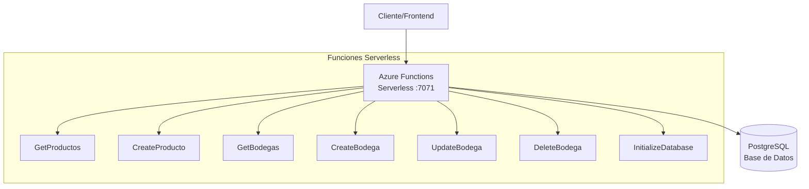
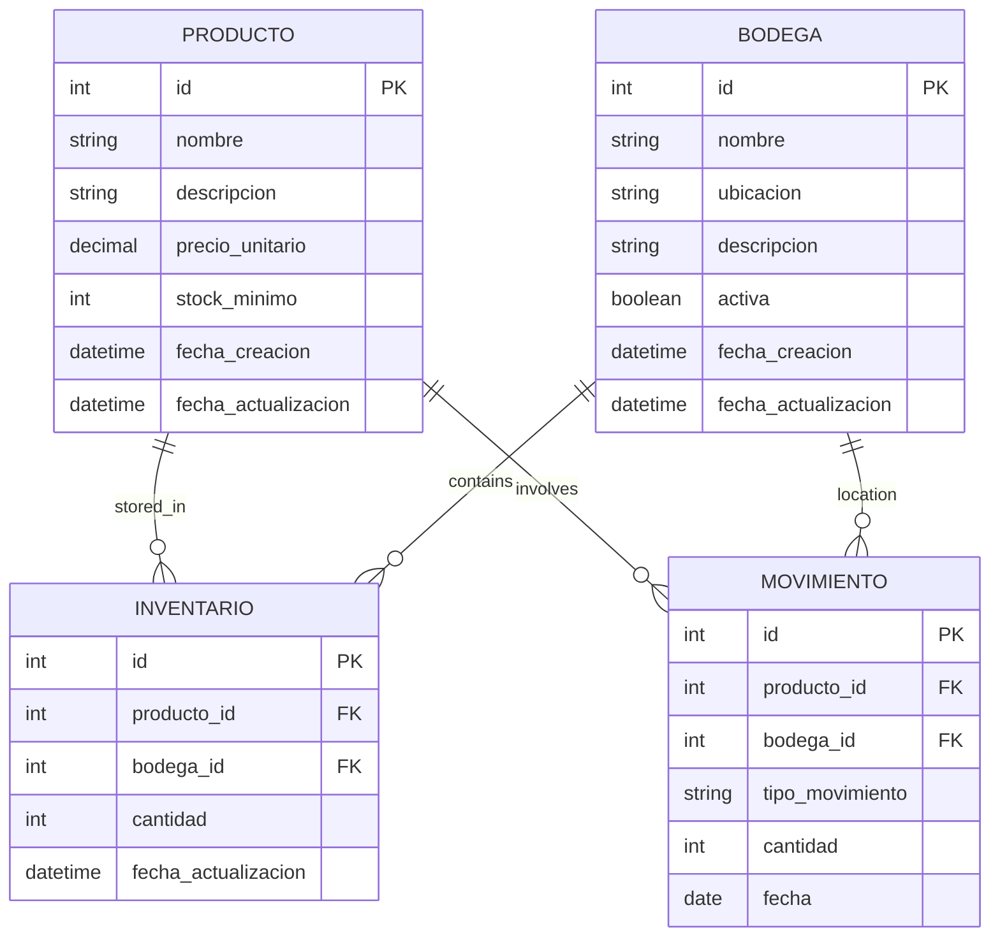

# Agranelos - Azure Functions Serverless Backend

Backend serverless para sistema de inventario de bodegas implementado con **Azure Functions** y PostgreSQL.

## Arquitectura del Sistema



El sistema implementa:

- **Funciones Serverless**: Azure Functions para operaciones CRUD directas sobre la base de datos
- **Base de Datos**: PostgreSQL con esquema normalizado para productos, bodegas, inventario y movimientos
- **CI/CD Automático**: GitHub Actions para despliegue automático a Azure Functions

## Modelo de Base de Datos



## Funciones Implementadas

El sistema expone los siguientes endpoints a través de las funciones serverless de Azure Functions:

### Azure Functions Serverless (Puerto 7071)
Endpoints de las funciones serverless:

#### Productos
| Verbo  | Ruta                  | Descripción                        |
| :----- | :-------------------- | :--------------------------------- |
| `GET`  | `/api/productos`      | Obtiene la lista de todos los productos. |
| `GET`  | `/api/productos/{id}` | Obtiene un producto específico por su ID. |
| `POST` | `/api/productos`      | Crea un nuevo producto.            |
| `PUT`  | `/api/productos/{id}` | Actualiza un producto existente por su ID. |
| `DELETE`| `/api/productos/{id}`| Elimina un producto por su ID.     |

#### Bodegas
| Verbo  | Ruta                  | Descripción                        |
| :----- | :-------------------- | :--------------------------------- |
| `GET`  | `/api/bodegas`        | Obtiene la lista de todas las bodegas. |
| `GET`  | `/api/bodegas/{id}`   | Obtiene una bodega específica por su ID. |
| `POST` | `/api/bodegas`        | Crea una nueva bodega.             |
| `PUT`  | `/api/bodegas/{id}`   | Actualiza una bodega existente por su ID. |
| `DELETE`| `/api/bodegas/{id}`  | Elimina una bodega por su ID.      |

#### Utilidades
| Verbo  | Ruta          | Descripción                        | Seguridad |
| :----- | :------------ | :--------------------------------- | :-------- |
| `POST` | `/api/init`   | Inicializa la base de datos con esquemas y datos de prueba. | ⚠️ **Sólo desarrollo** - Requiere `ENABLE_INIT=true` y clave de función |

### GraphQL API (Alternativa Moderna)

Además de los endpoints REST tradicionales, el sistema incluye soporte completo para **GraphQL** como alternativa moderna y flexible:

| Verbo  | Ruta          | Descripción                        |
| :----- | :------------ | :--------------------------------- |
| `POST` | `/api/graphql`| Endpoint único GraphQL para todas las operaciones |

#### Ejemplo de Queries GraphQL

**Query - Obtener todos los productos:**
```graphql
query {
  productos {
    id
    nombre
    descripcion
    precio
    cantidadEnStock
    fechaCreacion
  }
}
```

**Query - Obtener producto específico:**
```graphql
query {
  producto(id: "1") {
    id
    nombre
    descripcion
    precio
    cantidadEnStock
  }
}
```

**Mutation - Crear nuevo producto:**
```graphql
mutation {
  crearProducto(input: {
    nombre: "Producto GraphQL"
    descripcion: "Creado via GraphQL"
    precio: 29.99
    cantidad: 100
  }) {
    success
    message
    producto {
      id
      nombre
      precio
    }
    error
  }
}
```

**Mutation - Crear nueva bodega:**
```graphql
mutation {
  crearBodega(input: {
    nombre: "Bodega GraphQL"
    ubicacion: "Santiago Norte"
    capacidad: 5000
  }) {
    success
    message
    bodega {
      id
      nombre
      ubicacion
      capacidad
    }
    error
  }
}
```

**Query - Health Check:**
```graphql
query {
  health
}
```

#### Ventajas de GraphQL vs REST

- **Single Endpoint**: Un solo endpoint `/api/graphql` para todas las operaciones
- **Precise Data Fetching**: Solo obtén los campos que necesitas
- **Batching**: Múltiples queries en una sola petición
- **Introspección**: Schema auto-documentado
- **Type Safety**: Schema tipado fuerte
- **Real-time**: Soporte para subscripciones (futuro)

#### Ejemplo de Petición HTTP a GraphQL

```bash
curl -X POST http://localhost:7071/api/graphql \
  -H "Content-Type: application/json" \
  -d '{
    "query": "query { productos { id nombre precio } }"
  }'
```

> **💡 Tip**: Puedes usar tanto REST como GraphQL según tus necesidades. REST para operaciones simples, GraphQL para consultas complejas y flexibilidad.

> **⚠️ Importante**: El endpoint `/api/init` debe estar **deshabilitado en producción**. Configure `ENABLE_INIT=false` y use autenticación con clave de función cuando esté habilitado.

## Despliegue y Ejecución

### Prerrequisitos
- Java 11 (como está configurado en el workflow de GitHub Actions)
- Maven 3.6+
- PostgreSQL 13+
- Azure Functions Core Tools (para desarrollo local)
- Nix (opcional, para entorno de desarrollo)

### Configuración de Base de Datos
1. **PostgreSQL Local**:
   ```bash
   # Crear archivo .env en la raíz del proyecto (asegurar que esté en .gitignore)
   echo "POSTGRES_USER=inventario_user" > .env
   echo "POSTGRES_PASSWORD=inventario_pass" >> .env
   echo "POSTGRES_DB=inventario_db" >> .env
   
   # Usar PostgreSQL con archivo .env (evita credenciales en historial)
   docker run --name postgres-agranelos --env-file .env -p 5432:5432 -d postgres:13
   ```

2. **Inicialización del esquema**:
   El esquema se crea automáticamente usando el archivo `schema.sql`. También puedes usar la función de inicialización:
   ```bash
   # ⚠️ SOLO EN DESARROLLO - Configurar variables de entorno primero
   export ENABLE_INIT=true
   export FUNCTION_KEY=your-dev-function-key
   
   # Llamada POST con autenticación
   curl -X POST "http://localhost:7071/api/init?code=$FUNCTION_KEY" \
     -H "x-functions-key: $FUNCTION_KEY"
   ```
   
   **Configuración de seguridad para `/api/init`:**
   - **Desarrollo**: `ENABLE_INIT=true` en `local.settings.json`
   - **Producción**: `ENABLE_INIT=false` (por defecto)
   - **Autenticación**: Siempre requiere clave de función Azure
   - **Almacenamiento seguro**: Usar Azure Key Vault o variables de entorno para claves

### Ejecución Local

#### Opción 1: Usando Nix (Recomendado)
```bash
# Entrar al entorno de desarrollo
nix develop

# Compilar y ejecutar funciones serverless
mvn clean package
func host start --java
```

#### Opción 2: Ejecución Manual
```bash
# Compilar y ejecutar Azure Functions
mvn clean package
func host start --java
```

### Acceso a la Aplicación
- **Azure Functions**: http://localhost:7071

### Pruebas
```bash
# Ejecutar pruebas de las funciones serverless
mvn test
```

### Despliegue en Producción

#### Azure Functions
```bash
# Compilar para producción
mvn clean package

# Despliegue en Azure (requiere Azure CLI configurado)
func azure functionapp publish agranelos --java
```

### Variables de Entorno

#### Azure Functions (local.settings.json)
```json
{
  "IsEncrypted": false,
  "Values": {
    "AzureWebJobsStorage": "UseDevelopmentStorage=true",
    "FUNCTIONS_WORKER_RUNTIME": "java",
    "DB_HOST": "localhost",
    "DB_PORT": "5432", 
    "DB_NAME": "inventario_db",
    "DB_USER": "inventario_user",
    "DB_PASSWORD": "inventario_pass",
    "DB_SSL_MODE": "disable"
  }
}
```

## Estructura del Proyecto

```
agranelos-functions-crud-create/
├── src/                                    # Funciones serverless Azure
│   ├── main/java/com/agranelos/inventario/
│   │   ├── Function.java                   # Endpoints CRUD (productos y bodegas)
│   │   ├── db/                            # Gestión de base de datos
│   │   └── model/                         # Modelos de datos
│   └── test/                              # Pruebas unitarias
├── .github/workflows/main.yml             # Pipeline CI/CD GitHub Actions
├── schema.sql                            # Esquema de base de datos PostgreSQL
├── flake.nix                            # Entorno de desarrollo Nix
├── pom.xml                              # Build principal (Azure Functions)
├── host.json                            # Configuración Azure Functions
└── local.settings.json                  # Variables locales (no versionado)
```

## Configuración de Entornos

### Desarrollo Local
- **Azure Functions**: Puerto 7071
- **PostgreSQL**: Puerto 5432

### Variables de Entorno

#### Azure Functions (local.settings.json)
```json
{
  "IsEncrypted": false,
  "Values": {
    "AzureWebJobsStorage": "UseDevelopmentStorage=true",
    "FUNCTIONS_WORKER_RUNTIME": "java",
    "DB_HOST": "localhost",
    "DB_PORT": "5432",
    "DB_NAME": "inventario_db", 
    "DB_USER": "inventario_user",
    "DB_PASSWORD": "inventario_pass",
    "DB_SSL_MODE": "disable"
  }
}
```

### Seguridad y Secretos

#### GitHub Actions Secrets (Para Despliegue Automático)
El proyecto incluye un workflow de GitHub Actions (`.github/workflows/main.yml`) que despliega automáticamente las Azure Functions cada vez que se hace push a la rama `main`.

**Secretos necesarios en GitHub:**
1. Ve a **Settings > Secrets and variables > Actions**
2. Agrega los siguientes secretos:
   - `DB_HOST`: Host de la base de datos PostgreSQL
   - `DB_PORT`: Puerto de la base de datos (normalmente 5432)
   - `DB_NAME`: Nombre de la base de datos (ej: `inventario_db`)
   - `DB_USER`: Usuario de la base de datos
   - `DB_PASSWORD`: Contraseña de la base de datos
   - `DB_SSL_MODE`: Modo SSL de conexión (ej: `require` o `disable`)
   - `AZUREAPPSERVICE_PUBLISHPROFILE_233EB9B85DE548C18A928AC4CADA2CCE`: Perfil de publicación de Azure Function App

**Despliegue Automático:**
- ✅ **Trigger automático**: Push a rama `main` o Pull Request
- ✅ **Pipeline CI/CD**: Build → Test → Deploy
- ✅ **Java 11**: Configurado para usar Microsoft OpenJDK
- ✅ **Cache Maven**: Optimizado para builds rápidos
- ✅ **Despliegue a Azure**: Usa Azure Functions Action v1

#### Azure Function App Configuration
1. Portal de Azure > Function App > Configuration
2. Application Settings:
   - `DB_CONNECTION_STRING`
   - Otras variables según necesidades

## Guía de Despliegue Completo

### Métodos de Despliegue

#### 🚀 Opción 1: Despliegue Automático con GitHub Actions (Recomendado)
El proyecto incluye un workflow automatizado que se ejecuta en cada push a `main`:

```yaml
# El workflow se ejecuta automáticamente cuando:
# - Se hace push a la rama main
# - Se crea un Pull Request
# - Se ejecuta manualmente desde GitHub Actions
```

**Configuración:**
1. **Fork del repositorio** o configurar secretos en tu repo
2. **Configurar secretos** en GitHub (ver sección anterior)
3. **Obtener Publish Profile** de Azure Function App:
   ```bash
   # Descargar perfil desde Azure Portal
   az functionapp deployment list-publishing-profiles --name agranelos --resource-group <resource-group> --xml
   ```
4. **Push a main** - El despliegue se ejecuta automáticamente

**Monitoreo del despliegue:**
- Ve a **Actions** tab en GitHub para ver el progreso
- El workflow ejecuta: Build → Test → Deploy
- Tiempo estimado: 3-5 minutos

#### ⚙️ Opción 2: Despliegue Manual

### 1. Preparación del Entorno
```bash
# Clonar el repositorio
git clone <repository-url>
cd agranelos-functions-crud-create

# Entrar al entorno Nix (recomendado)
nix develop

# O instalar dependencias manualmente
# Java 17, Maven, Docker, Azure Functions Core Tools
```

### 2. Configuración de Base de Datos
```bash
# Iniciar PostgreSQL con Docker
docker run --name postgres-agranelos -e POSTGRES_PASSWORD=inventario_pass -e POSTGRES_USER=inventario_user -e POSTGRES_DB=inventario_db -p 5432:5432 -d postgres:13

# Verificar esquema (se crea automáticamente)
psql -h localhost -U inventario_user -d inventario_db -f schema.sql
```

### 3. Despliegue Local Completo
```bash
# Terminal 1: Azure Functions
mvn clean package
func host start --java

# Terminal 2: Verificar servicios
curl http://localhost:7071/api/productos
curl http://localhost:7071/api/bodegas
```

### 4. Despliegue a Azure

#### Opción A: Automático con GitHub Actions
```bash
# 1. Configurar secretos en GitHub (ver sección anterior)
# 2. Push a main trigger deployment automático
git add .
git commit -m "Deploy to Azure"
git push origin main

# 3. Monitorear en GitHub Actions tab
# 4. Verificar despliegue
curl https://agranelos.azurewebsites.net/api/productos
```

#### Opción B: Despliegue Manual con Azure CLI
```bash
# Autenticar con Azure
az login

# Crear recursos (si no existen)
az group create --name rg-agranelos --location eastus
az storage account create --name saagranelos --resource-group rg-agranelos
az functionapp create --name agranelos --resource-group rg-agranelos --storage-account saagranelos --runtime java --runtime-version 11

# Desplegar funciones manualmente
mvn azure-functions:deploy

# Configurar variables de entorno en Azure
az functionapp config appsettings set --name agranelos --resource-group rg-agranelos --settings DB_HOST="<db-host>" DB_PORT="5432" DB_NAME="inventario_db" DB_USER="<db-user>" DB_PASSWORD="<db-password>" DB_SSL_MODE="require"
```

### 5. Verificación Post-Despliegue
```bash
# Verificar Azure Functions (despliegue automático)
curl https://agranelos.azurewebsites.net/api/productos
curl https://agranelos.azurewebsites.net/api/bodegas

# Verificar estado del despliegue en GitHub
# Ve a: https://github.com/<tu-usuario>/<tu-repo>/actions
```

## Monitoreo y Mantenimiento

### Despliegue Continuo
- **GitHub Actions**: Monitorea el estado de despliegues en el tab Actions de GitHub
- **Rollback**: Usa `git revert` y push para hacer rollback automático
- **Environments**: Considera configurar environments (staging/production) en GitHub

### Logs y Diagnósticos
- **Azure Functions**: Portal de Azure > Function App > Monitor
- **GitHub Actions**: Logs detallados en cada ejecución del workflow
- **Base de datos**: Logs de PostgreSQL

### Health Checks
- **Functions**: `GET https://agranelos.azurewebsites.net/api/productos` (verificar respuesta)
- **Database**: Conectividad desde aplicaciones
- **CI/CD**: Badge de estado en README

### Troubleshooting Común
- **Fallo en GitHub Actions**: Verificar secretos y permisos
- **Error de conexión DB**: Validar variables de entorno en Azure Function App
- **Build fallido**: Verificar versión Java (11) y dependencias Maven

## Arquitectura Implementada

El sistema implementa un patrón **serverless** con las siguientes características:

- **Funciones Serverless**: Azure Functions para operaciones CRUD directas
- **Base de datos**: PostgreSQL con esquema normalizado
- **CI/CD Automático**: GitHub Actions para despliegue automático

Este diseño permite escalabilidad automática, costos optimizados y mantenimiento simplificado, ideal para sistemas de inventario serverless.

## CI/CD Pipeline - GitHub Actions

El proyecto incluye un pipeline de integración y despliegue continuo configurado en `.github/workflows/main.yml`:

### 🔄 Workflow Automático
```yaml
Trigger: Push a main, Pull Request, o Manual
Pipeline: Build → Test → Package → Deploy
Runtime: Java 11 con Maven
Target: Azure Function App "agranelos"
```

### 📋 Proceso Completo
1. **Checkout**: Descarga el código fuente
2. **Setup Java**: Configura JDK 11 Microsoft
3. **Cache Maven**: Optimiza builds con cache de dependencias
4. **Compile**: `mvn clean compile`
5. **Test**: `mvn test` - Ejecuta pruebas unitarias
6. **Package**: `mvn clean package` - Genera JAR
7. **Deploy**: Despliega a Azure Function App usando publish profile

### 🔐 Secretos Requeridos
Para que el workflow funcione correctamente, configura estos secretos en GitHub:

| Secreto | Descripción | Ejemplo |
|---------|-------------|---------|
| `DB_HOST` | Host PostgreSQL | `mydb.postgres.database.azure.com` |
| `DB_PORT` | Puerto de base de datos | `5432` |
| `DB_NAME` | Nombre de la base de datos | `inventario_db` |
| `DB_USER` | Usuario de base de datos | `inventario_user` |
| `DB_PASSWORD` | Contraseña de base de datos | `your-secure-password` |
| `DB_SSL_MODE` | Modo SSL | `require` |
| `AZUREAPPSERVICE_PUBLISHPROFILE_*` | Perfil de publicación de Azure | XML desde Azure Portal |

### 📊 Monitoreo del Pipeline
- **Estado**: Ve al tab **Actions** en GitHub
- **Logs**: Cada step tiene logs detallados
- **Notificaciones**: GitHub envía notificaciones por email en fallos
- **Badge**: Puedes agregar badge de estado al README

### 🚀 Uso del Pipeline
```bash
# Desarrollo normal - trigger automático
git add .
git commit -m "feat: nueva funcionalidad"
git push origin main  # ← Esto dispara el despliegue automático

# Verificar despliegue
# Ve a GitHub > Actions para monitorear el progreso
# El despliegue toma aproximadamente 3-5 minutos
```