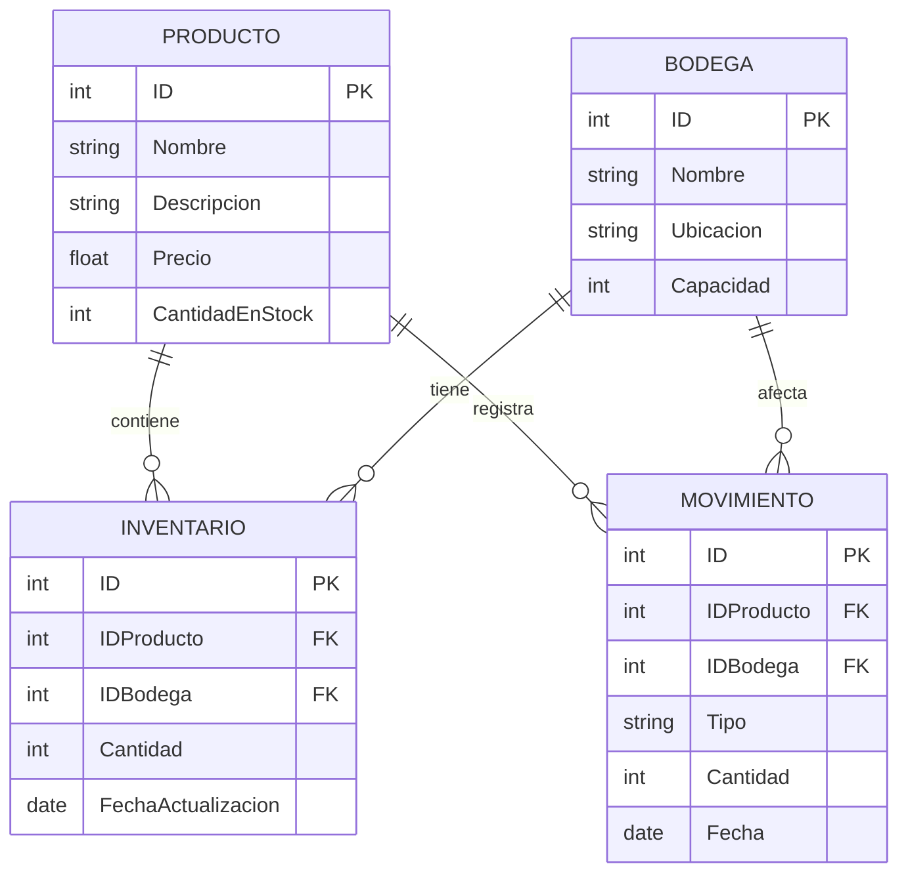

# Sistema Inventario - Bodegas Agranelos

## Arquitectura del Sistema

La arquitectura del sistema de inventario de productos está diseñada para ser modular, escalable y eficiente, aprovechando tecnologías modernas de desarrollo y despliegue de servicios en la nube. Aquí hay una descripción detallada de los componentes y cómo interactúan entre sí:

1. **Frontend (No Aplicable):**

    - Aunque tradicionalmente existe un componente frontend para interactuar con los usuarios finales, en este caso específico no se requiere su implementación. Las interacciones con el sistema se realizarán a través de llamadas directas a las APIs expuestas por el backend.
2. **Backend:**

    - **Microservicio BFF (Backend For Frontend):**
        - Este microservicio actúa como un intermediario que maneja las solicitudes entrantes.
        - Su responsabilidad principal es orquestar las llamadas a las funciones serverless correspondientes según la solicitud recibida.
        - Expone APIs RESTful que permiten al cliente realizar operaciones sobre productos y bodegas. Estas APIs devuelven datos en formato JSON, facilitando su consumo por parte del cliente.
3. **Funciones Serverless:**

    - Estas funciones están implementadas en Java y son responsables de ejecutar operaciones específicas de negocio.
    - **Funciones Clave:**
        - Realizan operaciones CRUD (Crear, Leer, Actualizar, Eliminar) sobre productos y bodegas.
        - Gestionan la lógica para manejar los cambios en el inventario, como registrar entradas y salidas de productos en las bodegas.
4. **Base de Datos:**

    - Contiene toda la información relevante del sistema, incluyendo datos de productos, bodegas, inventario actual y registros históricos de movimientos.
    - Las funciones serverless interactúan directamente con esta base de datos para realizar operaciones de lectura y escritura.
5. **Comunicación y Flujo de Datos:**

    - Las solicitudes del cliente (o llamadas directas) son recibidas por el Microservicio BFF.
    - El BFF procesa las solicitudes y determina qué funciones serverless deben ser invocadas para satisfacer la solicitud.
    - Las funciones serverless llevan a cabo las operaciones necesarias en la base de datos y devuelven los resultados al BFF.
    - El BFF responde al cliente con los resultados procesados y formateados en JSON.
6. **Tecnologías Utilizadas:**

    - **Docker:** Utilizado para el desarrollo y pruebas, permitiendo emular un entorno de producción localmente y facilitando la gestión de dependencias y configuraciones.
    - **Git y Herramientas Colaborativas:** Para la gestión del código fuente y la colaboración efectiva entre los miembros del equipo, asegurando un desarrollo organizado y control de versiones.
    - **Java y Spring Boot:** Tecnologías principales para la implementación de los microservicios y funciones serverless, aprovechando sus capacidades robustas para desarrollar aplicaciones empresariales.

Esta arquitectura aprovecha la naturaleza serverless para las funciones que interactúan con la base de datos, lo que permite escalabilidad automática y manejo eficiente de recursos según la demanda, asegurando un rendimiento óptimo y una alta disponibilidad del sistema.


## Base de Datos



## Funciones Implementadas

A continuación se detallan los endpoints de la API para la gestión de productos.

### Productos

| Verbo  | Ruta                  | Descripción                        |
| :----- | :-------------------- | :--------------------------------- |
| `GET`  | `/api/productos`      | Obtiene la lista de todos los productos. |
| `GET`  | `/api/productos/{id}` | Obtiene un producto específico por su ID. |
| `POST` | `/api/productos`      | Crea un nuevo producto.            |
| `PUT`  | `/api/productos/{id}` | Actualiza un producto existente por su ID. |
| `DELETE`| `/api/productos/{id}`| Elimina un producto por su ID.     |

## Compilación, Pruebas y Despliegue del Proyecto

Para probar y realizar despliegues del proyecto de Azure Functions con Java y Maven, sigue estos pasos:

---

## Configuración de secretos y variables de entorno

### 1. Subir secretos a GitHub Actions

Los secretos permiten almacenar información sensible (como contraseñas, claves API, etc.) de forma segura para usarlas en tus workflows de GitHub Actions.

**Pasos:**
1. Ve a tu repositorio en GitHub.
2. Haz clic en **Settings**.
3. En el menú lateral, selecciona **Secrets and variables > Actions**.
4. Haz clic en **New repository secret**.
5. Escribe el nombre del secreto (por ejemplo: `DB_PASSWORD`) y su valor.
6. Haz clic en **Add secret**.

Repite para cada secreto necesario (`DB_HOST`, `DB_USER`, `DB_PASSWORD`, etc.).

---

### 2. Subir variables de entorno a Azure Function App

Las Azure Function Apps usan “Application settings” para definir variables de entorno en producción.

**Pasos:**
1. Ve al portal de Azure: https://portal.azure.com/
2. Busca y selecciona tu **Function App**.
3. En el menú izquierdo, haz clic en **Configuration**.
4. En la pestaña **Application settings**, haz clic en **New application setting**.
5. Escribe el nombre (por ejemplo: `DB_PASSWORD`) y el valor.
6. Haz clic en **OK** y luego en **Save** (parte superior).
7. Reinicia la Function App si es necesario.

Repite para cada variable que necesites.

---

### 3. Template para `local.settings.json` (sin valores)

Este archivo es solo para desarrollo local y **no debe subirse a GitHub**. Sirve para definir variables de entorno cuando ejecutas las funciones localmente.

```json
{
  "IsEncrypted": false,
  "Values": {
    "AzureWebJobsStorage": "",
    "FUNCTIONS_WORKER_RUNTIME": "java",
    "DB_HOST": "",
    "DB_PORT": "",
    "DB_NAME": "",
    "DB_USER": "",
    "DB_PASSWORD": "",
    "DB_SSL_MODE": ""
  }
}
```

---

### 4. Conectar GitHub con Azure (Deployment Center)

Puedes automatizar el despliegue desde GitHub a Azure Functions usando el Deployment Center del portal de Azure:

1. Ve a tu **Function App** en el portal de Azure.
2. En el menú izquierdo, haz clic en **Deployment Center**.
3. Selecciona **GitHub** como fuente.
4. Autentica con tu cuenta de GitHub si es necesario.
5. Selecciona el repositorio y la rama que deseas conectar.
6. Completa el asistente y guarda la configuración.

A partir de ahora, cada vez que hagas push a la rama seleccionada, Azure desplegará automáticamente tu aplicación.

---

1. **Construcción y Pruebas Locales:**

    - Asegúrate de estar en el directorio del proyecto y de haber ingresado al entorno de desarrollo configurado con Nix:

        `nix develop`

    - Compila y ejecuta las pruebas del proyecto usando Maven:

        `mvn clean install`

    - Para probar las funciones localmente, puedes utilizar el siguiente comando:

        `mvn azure-functions:run`
        
    1.    - Alternativamente, puedes usar Azure Functions Core Tools desde el directorio raíz del proyecto:
    
        1. Asegúrate de tener instaladas las [Azure Functions Core Tools](https://learn.microsoft.com/azure/azure-functions/functions-run-local).
        2.    Navega al directorio de la aplicación de funciones dentro del repositorio:

                ```bash
                cd agranelos-functions-crud-create/inventario-functions-create
                ```
        3.    Inicia el host de funciones desde el subdirectorio de las funciones:
        
            ```bash
            func start
            ```
        4. Las funciones estarán disponibles en <http://localhost:7071>.


    Esto iniciará un servidor local de Azure Functions, permitiéndote invocar y probar tus funciones directamente desde tu entorno de desarrollo.

2. **Despliegue a Azure:**

    - Primero, asegúrate de estar autenticado en Azure CLI. Si no lo has hecho, ejecuta:

        `az login`

    - Despliega tu aplicación usando Maven. Esto empaquetará y desplegará tus funciones a Azure:

        `mvn azure-functions\:deploy`


    Asegúrate de tener configurado correctamente el archivo de configuración de Azure Functions y de que todos los recursos necesarios (como una cuenta de almacenamiento y una aplicación de funciones) estén disponibles en tu suscripción de Azure.

3. **Monitoreo y Verificación:**

    - Una vez desplegadas, puedes monitorear el estado de tus funciones a través del portal de Azure o mediante la CLI de Azure para verificar que estén operando correctamente.
    - Realiza pruebas de integración llamando a los endpoints de tus funciones desplegadas para asegurarte de que todo funciona como se espera en el entorno de producción.
